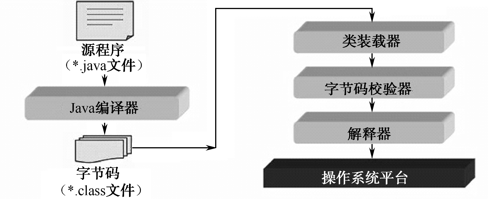

## 1.4  Java程序工作原理  
### 1.4.1  Java虚拟机  
&emsp;&emsp;Java虚拟机（Java Virtual Machine）简称JVM，它不是一台真实的机器，而是想象中的机器，通过模拟真实机器来运行Java程序。  
&emsp;&emsp;既然是模拟出来的机器，Java虚拟机看起来同样有硬件，如处理器、堆栈、寄存器等，还具有相应的指令系统。  
&emsp;&emsp;Java程序运行在这个抽象的Java虚拟机上，它是Java程序的运行环境，也是Java 最具吸引力的特性之一。  
&emsp;&emsp;前面提到过，Java语言的一个重要特点就是目标代码级的平台无关性，接下来将从原理上进一步说明为什么Java语言具有这样的平台无关性。实现Java“一次编译，处处运行”的关键就是使用了Java虚拟机。  
&emsp;&emsp;例如，使用C语言开发一个类似计算器的软件，如果想要这个软件在Windows平台运行，则需要在Windows平台下编译成目标代码，这个计算器的目标代码只能在Windows平台上运行。而如果想让这个计算器软件能在Linux平台上运行，则必须在对应的平台下编译，产生针对该平台的目标代码，才可以运行。  
&emsp;&emsp;对于Java而言，则完全不是这样。用Java编写的计算器程序（.java后缀）经过编译器编译成字节码文件，这个字节码文件不是针对具体平台的，而是针对抽象的Java虚拟机的，在Java虚拟机上运行。而在不同的平台上，会安装不同的Java虚拟机，这些不同的Java虚拟机屏蔽了各个不同平台的差异，从而使Java程序（字节码文件）具有平台无关性。也就是说，Java虚拟机在执行字节码时，把字节码解释成具体平台上的机器指令执行，具体原理如图1.1所示。  
 

图1.1  Java虚拟机
    

&emsp;&emsp;在理解了Java虚拟机的基础上，接下来介绍Java程序工作原理。如图1.2所示，Java字节码文件先后经过JVM的类装载器、字节码校验器和解释器，最终在操作系统平台上运行。具体各部分的主要功能描述如下。  

- 类装载器。其主要功能是为执行程序寻找和装载所需要的类，就是把字节码文件装到Java虚拟机中。  

- 字节码校验器。其功能是对字节码文件进行校验，保证代码的安全性。字节码校验器负责测试代码段格式并进行规则检查，检查伪造指针、违反对象访问权限或试图改变对象类型的非法代码。  
- 解释器。具体的平台并不认识字节码文件，最终起作用的还是这个最重要的解释器，它将字节码文件翻译成所在平台能识别的东西。  
 
 

图1.2  Java程序工作原理
    

### 1.4.2  垃圾回收机制  
&emsp;&emsp;在C++中，在程序结束运行之前对象会一直占用内存，在程序员明确释放之前不能将其所占内存分配给其他对象。而Java的处理方式不同，当没有对象引用指向原先分配给某个对象的内存时，该内存便成为垃圾。  
&emsp;&emsp;Java虚拟机提供了一个系统级线程（垃圾回收器线程），它自动跟踪每一块被分配出去的内存空间，自动释放被定义成垃圾的内存。  
&emsp;&emsp;垃圾回收机制能自动释放内存空间，减轻程序员编程的负担，这是Java 虚拟机具有的一个显著优点。在没有垃圾回收机制的时候，可能要花许多时间来解决释放无用内存的问题，而用Java语言编程的时候，靠垃圾回收机制可大大缩短时间。  
&emsp;&emsp;垃圾回收机制是一个系统级的线程，它给程序员带来好处的同时，也存在着影响系统性能的问题，因为它要追踪分配的内存，释放没用的内存，这个过程需要花费系统资源。  
&emsp;&emsp;程序员可以调用System.gc()这个方法通知Java虚拟机释放无用资源，但Java虚拟机会选择在合适的时候释放无用资源，具体释放的时间，不是程序员调用System.gc()的时刻，而是Java虚拟机决定的，程序员不能精确控制和干预。  
