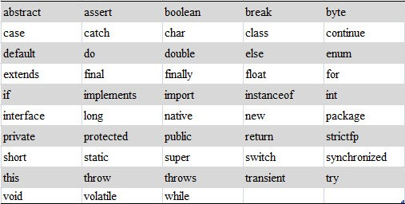

## 2.1  标识符和关键字

&emsp;&emsp;标识符是编程时使用的名字。要使用某个东西时，要用到它的名字来标识它，给这个东西起的名字，也需要有一定的规则，不能随便乱起名字。而关键字是事先定义好的、有特殊意义的标识符。

### 2.1.1  标识符  

&emsp;&emsp;Java对各种变量、方法和类等要素命名时使用的字符序列称为标识符。

&emsp;&emsp;给一个汉族小孩起名字，可以叫“张一二三四五六七八”吗？有的人会回答不可以。那为什么不可以呢？因为关于给小孩登记姓名，有《中华人民共和国姓名登记条例》，其中明确规定：姓名用字应当在2个汉字以上，6个汉字以下（民族自治地方的自治机关或者民族习俗对姓名的字数有规定或约定的，从其规定和约定），这个姓名超过了6个汉字，所以不可以。

&emsp;&emsp;同样的道理，Java标识符有如下命名规则。

&emsp;&emsp;（1）标识符由字母、数字、下划线“_”、美元符号“$”组成，并且首字符不能是数字。

&emsp;&emsp;（2）不能把Java关键字作为标识符。

&emsp;&emsp;（3）标识符没有长度限制。

&emsp;&emsp;（4）标识符对大小写敏感。

&emsp;&emsp;在企业的面试题里，常会出现这样的题目，下面的标识符中哪些是非法的？ 

&emsp;&emsp;stuAge、\*stuName、$count、3heartNum、public、x+y、_carSpeed、length10

&emsp;&emsp;stuName非法，原因是不能含“\*”；3heartNum非法，原因是首字符不可以是数字；public非法，原因是不可以是Java关键字；x+y非法，原因是不能含“+”，其他的标识符都是合法的。

&emsp;&emsp;作为一个程序员，写的程序中标识符不仅要合法，而且要简短且能清楚地表明含义，同时还要符合Java标识符的命名规范，这样可以让程序规范、易读。下面列举了不同类型（后面会详细介绍）的标识符的命名规则，需要遵照执行。

- 对于变量和方法名，要求第一个单词应以小写字母作为开头，后面的每个单词则都要以大写字母开头，例如stuAge、sendMessage。

- 对于类名，它和变量名、方法名的区别在于，第一个单词的首字母也需要大写，如果类名称中包含单词缩写，则这个缩写词的每个字母均应大写，例如XMLModule。另外，由于类是设计用来代表对象的，所以在命名类时应尽量选择名词。

- 常量标识符应该都使用大写字母，并且指出该常量完整的含义。如果一个常量名称由多个单词组成，则应该用下划线来分割这些单词，例如MAX_VALUE。

### 2.1.2  关键字  

&emsp;&emsp;Java关键字对Java编译器有特殊的意义，它们用来表示一种数据类型或者表示程序的结构等，关键字不能用作变量名、方法名、类名和包名。

&emsp;&emsp;大多数的编辑器（例如EditPlus和UltraEdit，不含记事本）和集成开发环境（Eclipse和MyEclipse）都会用特殊的方式（通常用蓝色）把Java关键字标识出来。

&emsp;&emsp;Java的关键字都是小写的英文字符串，goto这个标识符虽然从不使用，但也作为Java保留字进行保留，需要注意。图2.1列出了所有的Java关键字。

 

图2.1  Java关键字
  
