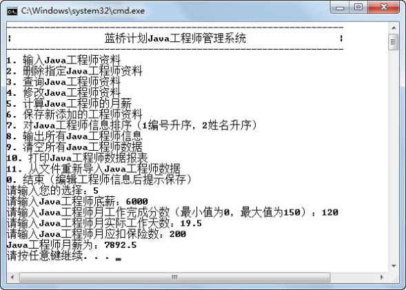

## 3.5  上机任务

#### 目标：

 

&emsp;&emsp;完成“蓝桥系统”主菜单向子功能的跳转，即当用户输入一个数字以后，跳转到该子功能模块。例如，如果用户输入5，则跳转到计算Java工程师的月薪模块。

&emsp;&emsp;程序运行结果如图3.6所示。

 图3.6  “蓝桥系统”主菜单向子功能的跳转 
  
实现思路： 

 

&emsp;&emsp;（1）使用switch语句实现，没有实现的模块直接打印“本模块功能未实现”，已实现的模块（例如模块5），执行相关功能。

&emsp;&emsp;（2）在main函数开始处，需要定义在相关模块中使用到的变量。

时间：15分钟。

 

形式：每个学员独立完成，小组组长检查。

 

工具：EditPlus。

 

