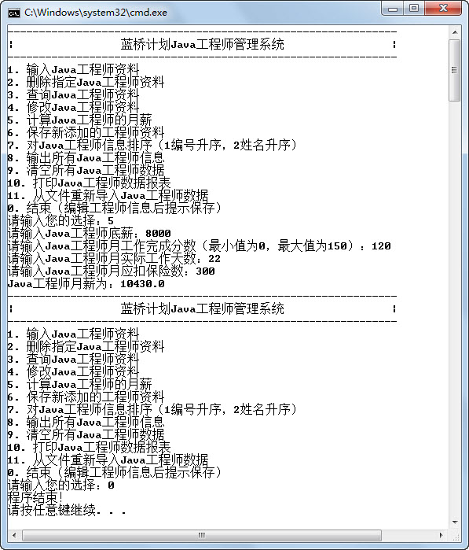

## 3.9  上机任务


#### 目标： 

 

&emsp;&emsp;修改“蓝桥系统”，当用户输入某个数（非0）时，执行该模块的功能，执行完毕之后，继续输出主界面。当用户输入0，则退出程序。程序运行结果如图3.15所示。

<p align="center"></p>
<p align="center">图3.15  使用while循环输出“蓝桥系统”主界面 </p>  
时间：20分钟。

 


形式：每个学员独立完成，小组组长检查。

 


工具：EditPlus。

 


#### 实现思路：参考图3.10对应程序的实现思路。

 


参考答案： 


```
import java.util.Scanner;

class JavaEngineer 

{

    public static void main(String[] args) 

    {

        double engSalary = 0.0;                     //Java工程师月薪

        int basSalary = 3000;        	      //底薪

        int comResult = 100;                   //月工作完成分数（最小值为0，最大值为150）

        double workDay = 22;                                      //月实际工作天数

        double insurance = 3000 * 0.105;                     //月应扣保险数

        Scanner input = new Scanner(System.in);        //从控制台获取输入的对象

        int userSel = -1;                                                 //用户选择的数

        while(true) //使用while(true)，在单个模块功能执行结束后，重新输出主界面，继续循环

        {

            //显示主界面

            System.out.println("-------------------------------------------------");

            System.out.println("|             蓝桥计划Java工程师管理系统                 |");

            System.out.println("-------------------------------------------------");

            System.out.println("1. 输入Java工程师资料");

            System.out.println("2. 删除指定Java工程师资料");

            System.out.println("3. 查询Java工程师资料");

            System.out.println("4. 修改Java工程师资料");

            System.out.println("5. 计算Java工程师的月薪");

            System.out.println("6. 保存新添加的工程师资料");

            System.out.println("7. 对Java工程师信息排序（1编号升序，2姓名升序）");

            System.out.println("8. 输出所有Java工程师信息");

            System.out.println("9. 清空所有Java工程师数据");

            System.out.println("10. 打印Java工程师数据报表");

            System.out.println("11. 从文件重新导入Java工程师数据");

            System.out.println("0. 结束（编辑工程师信息后提示保存）");

            System.out.print("请输入您的选择：");

            userSel = input.nextInt();

            switch(userSel)

            {

                case 1:

                System.out.println("本模块功能未实现");

                break;

                case 2:

                System.out.println("本模块功能未实现");               

                break;

                case 3:

                System.out.println("本模块功能未实现");

                break;

                case 4:

                System.out.println("本模块功能未实现");

                break;                           

                case 5:

                    System.out.print("请输入Java工程师底薪：" );

                    basSalary = input.nextInt();//从控制台获取输入的底薪，将其赋值给basSalary

                    System.out.print("请输入Java工程师月工作完成分数（最小值为0，最大值为150）：");

                    comResult = input.nextInt();          //从控制台获取输入的月工作完成分数，

                    ​                                     //赋值给comResult      

                    System.out.print("请输入Java工程师月实际工作天数：" );

                    workDay = input.nextDouble();     //从控制台获取输入的月实际工作天数，

                    ​                                 //赋值给workDay

                    System.out.print("请输入Java工程师月应扣保险数：" );

                    insurance = input.nextDouble();     //从控制台获取输入的月应扣保险数，

                    ​                                   //赋值给insurance

                    /*Java工程师月薪= 底薪 + 底薪×25%×月工作完成分数/100\+ 15×月实际工作天数 - 月应扣保险数；*/

                    engSalary = basSalary + basSalary*0.25*comResult/100 + 15*workDay – 
						insurance;

                    System.out.println("Java工程师月薪为：" + engSalary );

                    break;

                case 6:

                    System.out.println("本模块功能未实现");               

                    break;

                case 7:

                    System.out.println("本模块功能未实现");

                    break;

                case 8:

                    System.out.println("本模块功能未实现");

                    break;

                case 9:

                    System.out.println("本模块功能未实现");               

                    break;

                case 10:

                    System.out.println("本模块功能未实现");

                    break;

                case 11:

                    System.out.println("本模块功能未实现");

                    break;

                case 0:

                    System.out.println("程序结束！");

                    break;

                default:

                    System.out.println("数据输入错误！");

                    break;

            }

            if (userSel == 0)//当用户输入0时，退出while循环，结束程序

            {

            	break;

            }

        }

    }

}


```


