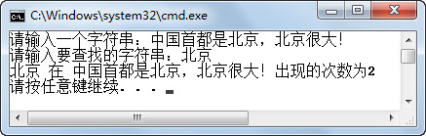

## 5.4  上机任务


#### 目标：计算字符串中子字符串出现的次数：让用户分别输入字符串和子字符串，输出子字符串出现的次数，程序运行结果如图5.7所示。

<p align="center"></p>
<p align="center"> 图5.7  统计子字符串出现的次数 </p>  


时间：10分钟。

 


形式：每个学员独立完成，小组组长检查。


工具：EditPlus。

参考答案：


```
import java.util.Scanner;

public class StrCount{

    public static void main(String[] args) {   

        int count = 0;      //用于计数的变量

        int start = 0;        //标识从哪个位置开始查找

        Scanner input = new Scanner(System.in);

        System.out.print("请输入一个字符串：");

        String str = input.next();

        System.out.print("请输入要查找的字符串：");

        String str1 = input.next();

        while (str.indexOf(str1, start) >= 0 && start < str.length()) {

            count++;

            //找到子字符串后，查找位置移动到找到的这个字符串之后开始

            start = str.indexOf(str1, start) + str1.length();

        }

        System.out.println(str1 + " 在 " + str + "出现的次数为" + count);

    }

}
```


