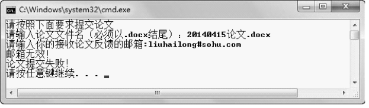
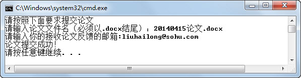

## 5.7  上机任务

#### 目标：完成提交论文的功能，具体需求如下，程序运行结果如图5.10、图5.11和图5.12所示。

&emsp;&emsp;（1）需要检查论文文件名，文件名必须以.docx结尾。

&emsp;&emsp;（2）需要检查接收论文反馈的邮箱，邮箱必须含“@”和“.”，且“.”在“@”之后。

<p align="center"></p>
<p align="center"> 图5.10  检查文件名和邮箱一 </p>  


<p align="center"></p>
<p align="center"> 图5.11  检查文件名和邮箱二</p>  


<p align="center"></p>
<p align="center">图5.12  检查文件名和邮箱三</p>  


时间：15分钟。

 

形式：每个学员独立完成，小组组长检查。


工具：EditPlus。


参考答案：


```
import java.util.Scanner;

public class FileUpload{

    public static void main(String[] args) {

        boolean fileCorrect = false;                     //标识论文文件名是否正确

        boolean emailCorrect = false;                           //标识邮箱是否正确

        System.out.println("请按照下面要求提交论文");

        Scanner input = new Scanner(System.in);

        System.out.print("请输入论文文件名（必须以.docx结尾）：");

        String fileName = input.next();

        System.out.print("请输入接收论文反馈的邮箱:");

        String email = input.next();

        //检查论文文件名

        if(fileName.endsWith(".docx")){

        	fileCorrect = true;                           //标识论文文件名正确

        }else{

        	System.out.println("文件名无效！");

        }

        //检查邮箱格式

        if(email.indexOf('@') != -1 && email.indexOf('.') > email.indexOf('@')){

        	emailCorrect = true;                        //标识邮箱正确

        }else{

        	System.out.println("邮箱无效！");

        }

        //输出结果

        if(fileCorrect&&emailCorrect){

        	System.out.println("论文提交成功！");

        }else{

        	System.out.println("论文提交失败！");

        }

    }

}
```