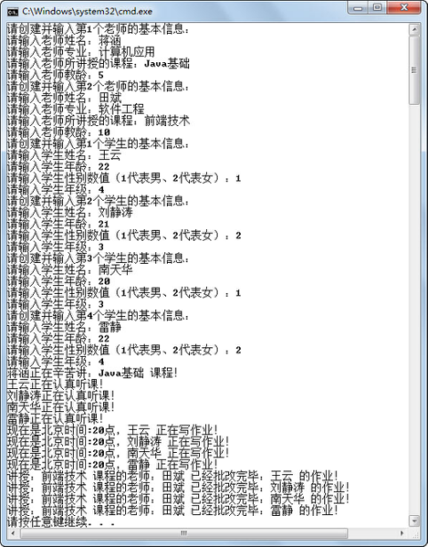
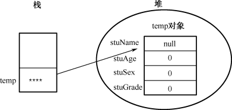
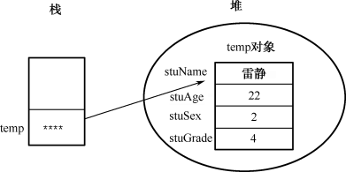

## 6.7  对象初始化过程


&emsp;&emsp;通过前面的学习，知道类中的成员变量初始化有以下几种情况。

- 创建对象时默认初始化成员变量。

- 定义类时，给成员变量赋初值。

- 调用构造方法时，使用构造方法所带的参数初始化成员变量。

&emsp;&emsp;在使用new关键字创建并初始化对象的过程中，具体的初始化分为4步。

&emsp;&emsp;（1）给对象的实例变量分配空间，默认初始化成员变量。

&emsp;&emsp;（2）成员变量声明时的初始化。

&emsp;&emsp;（3）初始化块初始化。

&emsp;&emsp;（4）构造方法初始化。

### 6.7.1  初始化块  

&emsp;&emsp;初始化块就是在类中用一对大括号括起来的代码块，语法形式如下：


```
{

	代码块

｝
```


&emsp;&emsp;初始化块可以用来初始化类的成员变量。但正如前面所说，使用初始化块初始化成员变量的顺序是在默认初始化成员变量以及成员变量声明时赋值之后，在使用构造方法初始化之前，请看下面的代码。


```
public class Student 

{

    private String stuName = "";  

    private int stuAge = -1;      

    private int stuSex = -1;      

    private int stuGrade =-1;    

    //使用初始化块初始化

    {       

        System.out.println("使用初始化块初始化");

        this.stuName = "雷静";

        this.stuAge = 22;

        this.stuSex = 2;   

        this.stuGrade = 4;

    }

    //无参构造方法

    public Student(){                            

        System.out.println("使用无参构造函数初始化");

    }

    //构造方法，用户初始化对象的成员变量

    public Student(String name,int age,int sex,int grade){                                   

        System.out.println("使用有参构造函数初始化");

        this.stuName = name;

        this.stuAge = age;

        this.stuSex = sex;         

        this.stuGrade = grade;

    }       

    //省略了Student类中的其他方法

}
```


&emsp;&emsp;新建测试类TestStudent7，其代码如下，运行结果如图6.9所示。


```
public class TestStudent7

{

    public static void main(String[] args) 

    {

        Student temp = new Student(); 

        System.out.println(temp.getStuName() + " 正在读大学" + temp.getStuGrade() + "年级");

        //构造方法初始化成员变量在初始化块初始化之后

        Student wangYun = new Student("王云",22,1,4);                        

        System.out.println(wangYun.getStuName() + " 正在读大学" + wangYun.getStuGrade() + "年级");

    }

}
```

<p align="center"></p>
<p align="center">图6.9  对象初始化过程</p>  

### 6.7.2  对象初始化内存结构  

&emsp;&emsp;刚才通过案例演示的方式，了解了对象初始化的过程，接下来通过图示内存结构的形式，让大家更加直观地了解对象初始化过程。

&emsp;&emsp;代码Student temp = new Student("王云",22,1,4);      运行后，内存结构如图6.10～图6.13所示。

&emsp;&emsp;（1）给对象的实例变量分配空间，默认初始化成员变量。

<p align="center"></p>
<p align="center">图6.10  对象初始化内存结构一</p>  

&emsp;&emsp;（2）成员变量声明时的初始化。

<p align="center"></p>
<p align="center">图6.11  对象初始化内存结构二</p>  
&emsp;&emsp;（3）初始化块初始化。

<p align="center"></p>
<p align="center">图6.12  对象初始化内存结构三</p>  

&emsp;&emsp;（4）有参构造函数初始化。

<p align="center"></p>
<p align="center">图6.13  对象初始化内存结构四</p>  


