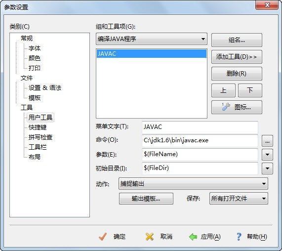
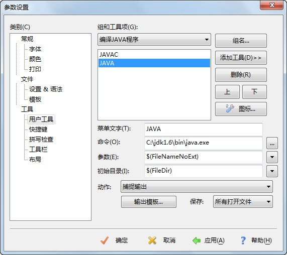
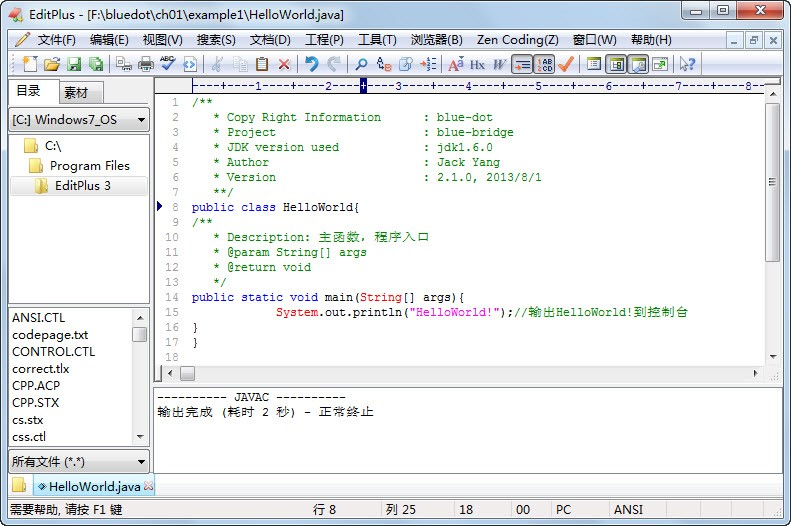

## 1.9  上机任务

#### 目标：编写“蓝桥计划Java工程师管理系统”（以下简称“蓝桥系统”）主界面。

#### 需求：主界面如图1.8所示。

 

  

图1.8  “蓝桥系统”主界面
  
#### 时间：20分钟。

#### 形式：每个学员独立完成，小组组长检查。

#### 工具：EditPlus。
### 使用EditPlus编辑Java程序  
&emsp;&emsp;第一个Java程序使用记事本作为编辑器，编写Java程序很不方便。在之后又介绍了两个常用的集成开发环境，用集成开发环境编写Java程序是很便利，但是对于Java初学者来说，不利于记住JDK的类和方法，所以在没有要求使用集成开发环境前，请不要使用。在记事本和集成开发环境之间，现在选择EditPlus这款功能强大的文字编辑器作为Java程序的编辑器使用。  
&emsp;&emsp;另外，通过EditPlus可以直接连接JDK，实现在EditPlus环境下调用JDK，编译、运行Java程序。  
&emsp;&emsp;首先启动EditPlus（以EditPlus 3.41版本为例），选择“工具”→“配置用户工具”命令，进入用户工具配置对话框，在类别里展开“工具”下的“用户工具”，选择“组和工具项”中的“工具组1”，单击“组名”，在弹出的对话框中将“工具组1”修改成“编译JAVA程序”（自定义名称），然后选择刚修改的组“编译JAVA程序”，选择“添加工具”→“应用程序”命令，开始添加工具。  
&emsp;&emsp;（1）添加编译功能。  
&emsp;&emsp;将“菜单文字”中的内容修改为“JAVAC”（自定义名称），在“命令”中选择JDK的javac.exe文件，例如“C:\jdk1.6\bin\javac.exe”（如果系统参数PATH已经设置，此处可以直接填写javac.exe），在“参数”中选择“文件名”，即显示为“$(FileName)”，在“初始目录”中选择“文件目录”，即显示为“$(FileDir)”，在“动作”中选择“捕获输出”，最后单击“应用”和“确定”按钮（如图1.9所示），即完成了添加编译功能。  
 

  

图1.9  使用EditPlus添加Java编译功能
    
&emsp;&emsp;（2）添加执行功能。  
&emsp;&emsp;添加执行功能和添加编译功能非常类似，不同之处在于“菜单文字”中的内容修改为“JAVA”（自定义名称），“命令”需要选择JDK中的java.exe文件，“参数”需要选择“文件名（不含扩展名）”，其他的和添加编译功能一致，如图1.10所示。  
 

  

图1.10  使用EditPlus添加Java运行功能
    
&emsp;&emsp;接下来可以把HelloWorld程序粘贴到EditPlus中，按Ctrl+1组合键会编译程序，如图1.11所示。再按Ctrl+2组合键则会运行刚才编译的程序，如图1.12所示。编译的所有信息都会显示在输出窗口中，如果出现错误，双击某一行错误信息，EditPlus会自动定位到出错行。  
 

  

图1.11  使用EditPlus编译HelloWorld程序
    
 

 
  

图1.12  使用EditPlus运行HelloWorld程序
    