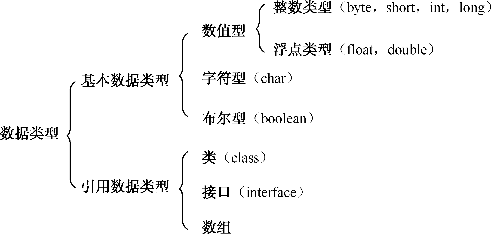
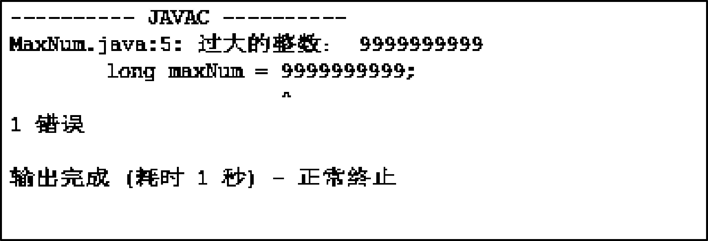
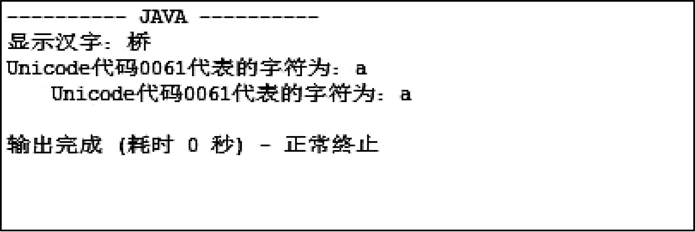
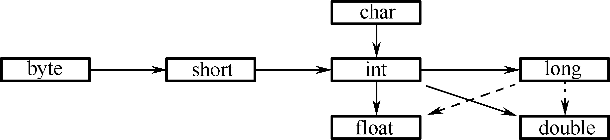
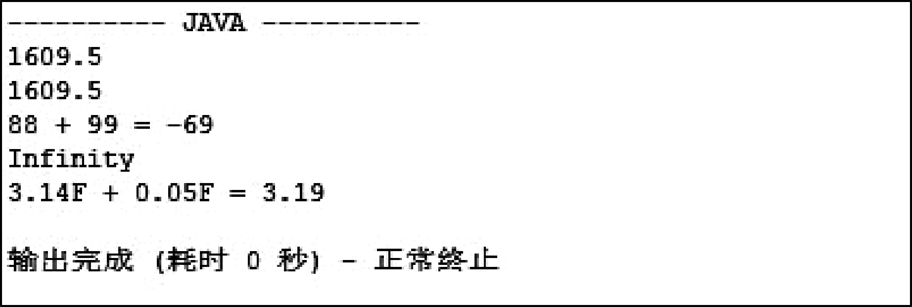

## 2.3  Java数据类型


&emsp;&emsp;变量声明包括变量的数据类型和变量名，那什么是数据类型呢？什么是Java的数据类型和Java基本数据类型呢？


### 2.3.1  Java数据类型概述  

&emsp;&emsp;假设编写程序让计算机完成这样的操作：一个学生的年龄是22岁，新年的钟声敲响之后，他的年龄就应该增加一岁，即为22+1。计算机如何执行这样的操作呢？首先，计算机要向内存申请一块空间，存放22这个数字，再申请一块空间，存放1这个数字，然后让计算机求这两个数字的和，存放到内存中。

&emsp;&emsp;现在是用整数存储学生的年龄，申请了一块内存空间，如果要存储学生的姓名，或者存储学生的成绩（例如78.5），也是申请同样大小的一块内存空间吗？这样的内存空间能存下需要存储的数据吗？答案是否定的。

&emsp;&emsp;根据能对数据进行的操作以及数据所需内存大小的不同，把数据分成不同的类型。编程的时候需要用大数据的时候才需要申请大内存，这样就可以充分利用内存。 

&emsp;&emsp;Java数据类型分为两大类，即基本数据类型和引用数据类型，如图2.3所示。其中引用数据类型又分为类、接口和数组，不是本章介绍的重点，在后面的课程中会详细介绍。

<p align="center"></p> 
<p align="center">图2.3  Java数据类型</p>  

&emsp;&emsp;Java基本数据类型分为4种，分别是整型、浮点型、字符型和布尔型。表2.1列出了不同的Java基本数据类型所占的字节数、位数和使用说明。  
<p align="center">表2.1  Java基本数据类型说明</p>  

| 数据类型 | 字节数 | 位数 | 使 用   说 明 |
| -------- | ------ | ---- | --------------------------------------------------------- |
| byte     | 1      | 8    | 取值范围：-27～27-1                                       |
| short    | 2      | 16   | 取值范围：-215～215-1                                     |
| int      | 4      | 32   | 取值范围：-231～231-1                                     |
| long     | 8      | 64   | 取值范围：-263～263-1，直接赋值时必须在数字后加上l或L     |
| float    | 4      | 32   | 取值范围：1.4E-45～3.4E38，直接赋值时必须在数字后加上f或F |
| double   | 8      | 64   | 取值范围：4.9E-324～1.8E308                               |
| char     | 2      | 16   | 使用Unicode编码（2个字节），可存汉字                      |
| boolean  | —      | —    | 只有true和false两个取值                                   |


### 2.3.2  整型  

&emsp;&emsp;Java各整数类型有固定的表示范围和字段长度，其不受具体操作系统的影响，以保证Java程序的可移植性。

&emsp;&emsp;Java语言整型常量有以下3种表示形式。

&emsp;&emsp;（1）十进制整数，例如12，-127，0。

&emsp;&emsp;（2）八进制整数，以0开头，例如014（对应于十进制的12）。

&emsp;&emsp;（3）十六进制整数，以0x或0X开头，例如0XC（对应于十进制的12）。

&emsp;&emsp;进制转换的内容不是本书涉及的范畴，如有不清楚的，请查阅相关资料。

&emsp;&emsp;Java语言的整型常量默认为int型，声明long型的整型常量需要在常量后面加上“l”或“L”，例如：


```
long maxNum = 9999999999L;
```


&emsp;&emsp;看下面的程序，其运行结果如图2.4所示。


```
class MaxNum{

    public static void main(String[] args) {

        long maxNum = 9999999999;

        System.out.println(maxNum);

    }

}
```
<p align="center"></p> 
<p align="center">图2.4  整型常量默认为int型</p>  

&emsp;&emsp;程序运行出错的原因为，Java语言的整型常量默认为int型，其最大值为2 147 483 647，而在给maxNum赋值时，等号右边的整型常数为9999999999，大于int型的最大值，所以报错。处理方法是在9999999999后面加个“L”（或“l”）。    

&emsp;&emsp;都是为了存整数，Java语言设计出4种整型类型的目的是存不同大小的数，这样可以节约存储空间，对于一些硬件内存小或者要求运行速度快的系统显得尤为重要。例如，需要存储一个两位整数，其数值范围在-99到99之间，程序员就可以使用byte类型进行存储，因为byte类型的取值范围为-128到127之间。  

### 2.3.3  浮点型  

&emsp;&emsp;在计算机系统的发展过程中，曾经提出过多种表示实数的方法，但是到目前为止使用最广泛的是浮点表示法。相对于定点数而言，浮点数利用指数使小数点的位置可以根据需要而上下浮动，从而可以灵活地表达更大范围的实数。

&emsp;&emsp;Java浮点类型常量有以下两种表示形式。

&emsp;&emsp;（1）十进制形式，例如3.14，314.0，.314。

&emsp;&emsp;（2）科学记数法形式，例如3.14e2，3.14E2，100E-2。

&emsp;&emsp;Java语言浮点型常量默认为double型，声明一个float型常量，则需要在常量后面加上“f”或“F”，例如：


```
float floatNum = 3.14F;
```


&emsp;&emsp;不同于整型，通过简单的推算，程序员就可以知道这个类型的整数的取值范围。对于float和double，要想推算出来，需要理解浮点型的存储原理，且计算起来比较复杂。接下来，通过下面的程序，可以直接在控制台输出这两种类型的最小值和最大值，程序运行结果如图2.5所示。


```
class FloatDoubleMinMax{

        public static void main(String[] args) {  

                   System.out.println("float最小值 = " + Float.MIN_VALUE);    

                   System.out.println("float最大值 = " + Float.MAX_VALUE);

                   

                   System.out.println("double最小值 = " + Double.MIN_VALUE);    

                   System.out.println("double最大值 = " + Double.MAX_VALUE);

         }

} 
```
<p align="center"></p> 
<p align="center">图2.5  浮点型数的取值范围</p>  

### 2.3.4  字符型  

&emsp;&emsp;字符型（char型）数据用来表示通常意义上的字符。

&emsp;&emsp;字符常量为用单引号括起来的单个字符，因为Java使用Unicode编码，一个Unicode编码占2个字节，一个汉字也是占2个字节，所以Java中字符型变量可以存放一个汉字，例如：


```
char eChar = 'q';

char cChar = '桥';
```


&emsp;&emsp;Java字符型常量有以下3种表示形式。

&emsp;&emsp;（1）用英文单引号括起来的单个字符，例如'a'、'汉'。

&emsp;&emsp;（2）用英文单引号括起来的十六进制字符代码值来表示单个字符，其格式为'\uXXXX'，其中u是约定的前缀（u是Unicode的第一个字母），而后面的XXXX位是4位十六进制数，是该字符在Unicode字符集中的序号，例如'\u0061'。

&emsp;&emsp;（3）某些特殊的字符可以采用转义符'\'来表示，将其后面的字符转变为其他的含义，例如'\t'代表制表符，'\n'代表换行符，'\r'代表回车符等。

&emsp;&emsp;通过下面的程序及程序的运行结果（如图2.6所示），可以进一步了解Java字符的使用方法。


```
class CharShow{

         public static void main(String[] args){

                   char eChar = 'q';

                   char cChar = '桥';

                   System.out.println("显示汉字：" + cChar);

                   char tChar = '\u0061';

                   System.out.println("Unicode代码0061代表的字符为：" + tChar);

                   char fChar = '\t';

                   System.out.println(fChar+"Unicode代码0061代表的字符为：" + tChar);

         }

}
```
<p align="center"></p> 
<p align="center">图2.6  Java字符的使用</p>  

### 2.3.5  布尔型  

&emsp;&emsp;Java中boolean类型可以表示真或假，只允许取值true或false（不可以用0或非0的整数替代true和false，这点和C语言不同），例如：


```
boolean flag = true;
```

&emsp;&emsp;boolean类型适于逻辑运算，一般用于程序流程控制，后面流程控制的课程经常会使用到布尔型。

&emsp;&emsp;在表2.1 Java基本数据类型说明中，只有boolean类型没有注明其占多少个字节，有兴趣的可以好好研究一下。

### 2.3.6  基本数据类型转换  

&emsp;&emsp;Java的数据类型转换分为以下3种：基本数据类型转换，字符串与其他数据类型转换，其他实用数据类型转换。本节介绍Java基本数据类型转换，其中boolean类型不可以和其他的数据类型互相转换。整型、字符型、浮点型的数据在混合运算中相互转换遵循以下原则。

- 容量小的类型自动转换成容量大的数据类型（如图2.7所示）。

- byte、short、char之间不会互相转换，三者在计算时首先会转换为int类型。

- 容量大的数据类型转换成容量小的数据类型时，需要加上强制转换符，但可能造成精度降低或溢出，使用时需要格外注意。

- 有多种类型的数据混合运算时，系统首先自动地转换成容量最大的数据类型，然后再进行计算。


<p align="center"></p> 
<p align="center">图2.7  Java基本数据类型转换</p>  

&emsp;&emsp;注：实箭头表示无信息丢失的转换，虚箭头表示可能有精度损失的转换。

&emsp;&emsp;通过下面的程序及程序的运行结果（如图2.8所示），可以进一步加深对Java基本数据类型转换的认识。


```
class TestConvert{

    public static void main(String[] args){

        int i1 = 222; 

        int i2 = 333;

        double d1 = (i1+i2)*2.9;         		//系统将转换为double型运算

        float f1 = (float)((i1+i2)*2.9);		//从double型转换成float型，需要进行强制类型转换

        System.out.println(d1);

        System.out.println(f1);


        byte b1 = 88; 

        byte b2 = 99;

        byte b3 = (byte)(b1+b2); 				//系统先转换为int型运算，再从int型转换成byte型

						                        //需要进行强制类型转换

        System.out.println("88 + 99 = " + b3);	//强制类型转换，数据结果溢出


        double d2 = 5.1E88;

        float f2 = (float)d2;					//从double型强制转换成float型，结果溢出

        System.out.println(f2);


        float f3 = 3.14F;

        f3 = f3 + 0.05F;//这条语句不能写成f3 = f3 + 0.05;，否则会报错，因为0.05是double型，

        //加上f3，仍然是double型，赋给float会报错

        System.out.println("3.14F + 0.05F = " + f3);

    }

}
```
<p align="center"></p> 
<p align="center">图2.8  Java基本数据类型转换</p>  
