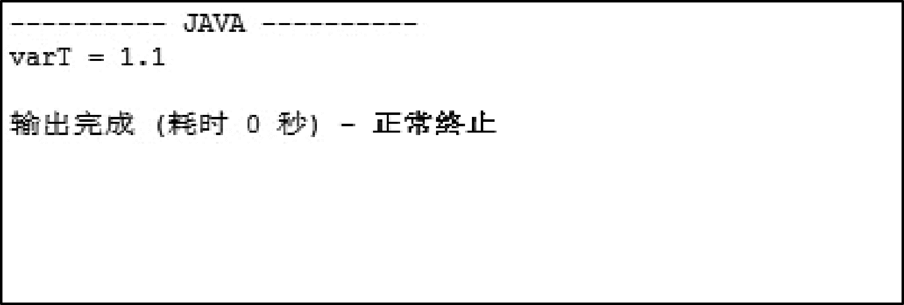

## 2.4  成员变量和局部变量

 

&emsp;&emsp;根据变量声明位置的不同，可以将变量分为成员变量和局部变量。

&emsp;&emsp;成员变量是在类的内部、方法（含语句块）外部定义的变量，其作用域从变量定义位置起到类结束。而局部变量是在方法（含语句块）内部定义的变量（包括形参），其作用域从变量定义位置起到方法（含语句块）结束。对于Java而言，类的外面不能有变量的声明。

&emsp;&emsp;下面的程序演示了成员变量和局部变量的作用域，请仔细阅读代码中的注释，运行结果如图2.9所示。

``` 

class VarScope{

    static float varQ = 9.1F;        //成员变量，其作用域从变量定义位置起至类结束

    {

        int varB = 10;               //语句块中的局部变量，其作用域从变量定义位置起至语句块结束

        System.out.println("varB = " + varB);     //可以使用本语句块中的局部变量varB

        System.out.println("varQ = " + varQ);    //可以使用成员变量varQ

    }

    public static void main(String[] args) {

        int varL = 8;                //方法中的局部变量，其作用域从变量定义位置起至方法结束 

        System.out.println("varL = " + varL);     //可以使用本方法中的局部变量varL

        System.out.println("varQ = " + varQ);    //可以使用成员变量varQ

        //System.out.println("varB = " + varB);  //不可以使用其他方法（或语句块）中的局部变量

    }

    float varT = varQ + 1.0F; 		 //可以使用成员变量varQ，varT本身也是成员变量

}
```

<p align="center"></p> 
<p align="center">图2.9  成员变量和局部变量</p>  

&emsp;&emsp;再看下面的例子，运行结果如何呢？


```
class VarScope2 {

    float varT = 9.1F;              			//成员变量，其作用域从变量定义位置起至类结束

    public void show(){

        float varT = 1.1F;        			//方法中的局部变量，其作用域从变量定义位置起至方法结束

        System.out.println("varT = " + varT);	//在控制台，输出的是9.1还是1.1呢？

        //float varT = 12.3F;					//不可以在同一个作用域内，定义两个同名变量

        }

    public static void main(String[] args) {

        VarScope2 v2 = new VarScope2();

        v2.show();                         		//调用show()方法；

        }

}
```

&emsp;&emsp;程序运行结果如图2.10所示，通过这个例子可以看出，方法中的局部变量可以和方法外的成员变量同名，如本例中的varT变量。在使用的时候，如果在局部变量所在的方法体内，局部变量覆盖成员变量，输出的结果是局部变量的值；如果在局部变量所在的方法体外，不在局部变量的作用域内，输出的是成员变量的值。


<p align="center"></p> 
<p align="center">图2.10  成员变量和局部变量同名</p>  

&emsp;&emsp;另外还需要注意的是，在Java中声明的成员变量可以不赋初始值，有默认的初始值（基本数据类型默认初始值为0、0.0、'\u0000'和false），如果声明局部变量则必须赋初始值。


