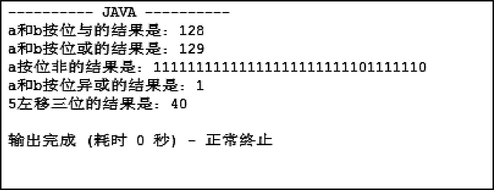

## 2.6  Java运算符

 

&emsp;&emsp;Java语言支持如下运算符。

- 算术运算符：+、-、*、/、%、++、- -。

- 关系运算符：>、<、>=、<=、= = 、!=。

- 赋值运算符：=、+=、-=、*=、/=等。

- 逻辑运算符：！、&&、||等。

- 位运算符：~、&、|、^、>>、<<、>>>（无符号右移）。

### 2.6.1  算术运算符  

&emsp;&emsp;从参与运算的项数分，可以将算术运算符分为以下3类。

&emsp;&emsp;（1）单目运算符：+（取正）、-（取负）、++（自增1）、--（自减1）。

&emsp;&emsp;（2）双目运算符：+、-、*、/、%（取余）。

&emsp;&emsp;（3）三目运算符：(表达式1)?(表达式2):(表达式3)，当表达式1的结果为真时，整个运算的结果为表达式2，否则为表达式3，该运算符是Java语言唯一一个三目运算符，常被使用，需要掌握。

&emsp;&emsp;通过下面的例子，来重点学习++、--、%和三目运算符这四个算术运算符。


```
class ArithmeticOpr{

    public static void main(String[] args) {

        int i1 = 10, i2 = 20;

        int i = (i2++);               //++在i2后，故先运算（赋值）再自增

        System.out.print("i = " + i);

        System.out.println(" i2 = " + i2);

        i = (++i2);                    //++在i2前，故先自增再运算（赋值）

        System.out.print("i = " + i);

        System.out.println(" i2 = " + i2);

        i = (--i1);                      //--在i1前，故先自减再运算（赋值）

        System.out.print("i = " + i);

        System.out.println(" i1 = " + i1);

        i = (i1--);                      //--在i1后，故先运算（赋值）再自减

        System.out.print("i = " + i);

        System.out.println(" i1 = " + i1);


        System.out.println("10 % 3 = " + 20%3);

        System.out.println("20 % 3 = " + 10%3);


        int rst = (20 % 3)>1 ? -10 : 10;


        System.out.println("(20 % 3)>1 ? -10 : 10 = " + rst);

    }

}
```


&emsp;&emsp;程序运行结果如图2.11所示，通过这个例子可以看出，++和--这两个运算符放在操作数前或后，决定着是先自增（或自减）再运算，还是先运算再自增（或自减）。

<p align="center"></p> 
<p align="center">图2.11  算术运算符程序示例运行结果</p>  

&emsp;&emsp;第1章编写了“蓝桥系统”的主界面，其中第五项内容为“计算Java工程师月薪”，接下来单独完成这一模块的功能。

&emsp;&emsp;假设Java工程师的月薪按以下方式计算。

&emsp;&emsp;Java工程师月薪=月底薪+月实际绩效+月餐补-月保险

&emsp;&emsp;其中：

- 月底薪为固定值。

- 月实际绩效=月绩效基数（月底薪×25%）×月工作完成分数（最小值为0，最大值为150）/100。

- 月餐补=月实际工作天数×15。

- 月保险为固定值。

&emsp;&emsp;计算Java工程师月薪时，用户输入月底薪、月工作完成分数（最小值为0，最大值为150）、月实际工作天数和月保险4个值后，即可以计算出Java工程师月薪。具体代码如下。


```
import java.util.Scanner;

class CalSalary {

    public static void main(String[] args) {

        double engSalary = 0.0;                                    //Java工程师月薪

        int basSalary = 3000;                                        //底薪

        int comResult = 100;                                         //月工作完成分数（最小值为0，最大值为150）

        double workDay = 22;                                      //月实际工作天数

        double insurance = 3000 * 0.105;                     //月应扣保险数


        Scanner input = new Scanner(System.in);        //从控制台获取输入的对象

        System.out.print("请输入Java工程师底薪：" );

        basSalary = input.nextInt();   //从控制台获取输入——即底薪，赋值给basSalary

        System.out.print("请输入Java工程师月工作完成分数（最小值为0，最大值为150）：" );

        comResult = input.nextInt(); //从控制台获取输入——即月工作完成分数，赋值给comResult

        System.out.print("请输入Java工程师月实际工作天数：" );

        workDay = input.nextDouble();      //从控制台获取输入——即月实际工作天数，赋值给workDay

        System.out.print("请输入Java工程师月应扣保险数：" );

        insurance = input.nextDouble();     //从控制台获取输入——即月应扣保险数，赋值给insurance


        //Java工程师月薪= 底薪 + 底薪×25%×月工作完成分数/100 + 15×月实际工作天数 

        //- 月应扣保险数

        engSalary = basSalary + basSalary*0.25*comResult/100 + 15*workDay - insurance;

        System.out.println("Java工程师月薪为：" + engSalary );

    }

}
```


&emsp;&emsp;本程序需要从控制台获取输入，所以在程序的第一行加入了代码import java.util.Scanner;，引入Scanner工具类，通过该工具类从控制台获取输入。具体获取输入的代码，通过程序中的注释，很容易看明白。

&emsp;&emsp;另外，原来在EditPlus的“配置用户工具”中配置的“JAVA”工具，其“动作”选择的是“捕捉输出”，因本程序需要输入，故需要将动作改为“无”（见图2.12）。这样可以在需要输入的时候，启动控制台进行输入操作。  

<p align="center"></p> 
<p align="center">图2.12  设置EditPlus工具动作</p>  

&emsp;&emsp;程序的实际运行结果如图2.13所示。  

<p align="center"></p> 
<p align="center">图2.13  计算Java工程师月薪</p>  

### 2.6.2  逻辑运算符  

&emsp;&emsp;关系运算符和赋值运算符比较简单，这里不展开介绍。需要注意的是，关系运算符“==”和赋值运算符“=”看起来比较类似，但含义完全不同，“==”用于判断两边是否相等，而“=”是将右边的值赋给左边。

&emsp;&emsp;+=、-=等是扩展的赋值运算符，x += y等价于x = x + y，程序员在实际的编程过程中，为了方便阅读，尽量不要使用这种扩展的赋值运算符。

&emsp;&emsp;接下来重点介绍逻辑运算符和位运算符。在Java语言中有3种逻辑运算符，它们是逻辑非（用符号“!”表示）、逻辑与（用符号“&&”表示）和逻辑或（用符号“||”表示）。

&emsp;&emsp;逻辑非表示取反，其逻辑关系值表如表2.2所示。

<p align="center">表2.2  逻辑非关系值表</p>  

|A|	!A|
|----|----|
|true	|false|
|false|	true|


&emsp;&emsp;逻辑与的运算规则为：有一个运算数为假，其值为假，两个运算数都为真，其值为真。逻辑与的关系值表如表2.3所示。
<p align="center">表2.3  逻辑与关系值表</p>  


| A     | B     | A&&B  |
| ----- | ----- | ----- |
| false | false | false |
| true  | false | false |
| false | true  | false |
| true  | true  | true  |

 

&emsp;&emsp;逻辑或的运算规则为：有一个运算数为真，其值为真，两个运算数都为假，其值为假。逻辑或的关系值表如表2.4所示。
<p align="center">表2.4  逻辑或关系值表</p>  


| A     | B     | A&#124;&#124;B |
| ----- | ----- | ------ |
| false | false | false  |
| true  | false | true   |
| false | true  | true   |
| true  | true  | true   |

 

&emsp;&emsp;逻辑运算符在后面流程控制的课程中会经常用到，这里不再赘述。

### 2.6.3  位运算符  

&emsp;&emsp;在计算机中，所有的信息都是以二进制形式存储的，可以对整数的二进制位进行相关的操作，这就是位运算符。位运算符主要包括按位非（用符号“~”表示）、按位与（用符号“&”表示）、按位或（用符号“|”表示）、按位异或（用符号“^”表示）和移位运算符（用符号“<<”、“>>”、“>>>”表示）。

&emsp;&emsp;在企业面试Java工程师的时候，也常会问到“&&”和“&”以及“||”与“|”的区别，通过下面的学习，可以清楚地理解逻辑运算符和位运算符的区别。

&emsp;&emsp;按位非表示按位取反，其关系值表如表2.5所示。
<p align="center">表2.5  按位非的关系值表</p>  

|A	|~A|
|----|----|
|1	|0|
|0	|1|


&emsp;&emsp;按位与是逐位逻辑与。按位与的关系值表如表2.6所示。
<p align="center">表2.6  按位与的关系值表</p>  


| A    | B    | A&B  |
| ---- | ---- | ---- |
| 1    | 1    | 1    |
| 1    | 0    | 0    |
| 0    | 1    | 0    |
| 0    | 0    | 0    |

 

&emsp;&emsp;按位或是逐位逻辑或。按位或的关系值表如表2.7所示。
<p align="center">表2.7  按位或的关系值表</p>  


| A    | B    | A&#124;B |
| ---- | ---- | ---- |
| 1    | 1    | 1    |
| 0    | 1    | 1    |
| 1    | 0    | 1    |
| 0    | 0    | 0    |

 

&emsp;&emsp;按位异或是当两个运算位不同时，结果为1，否则为0。按位异或的关系值表如表2.8所示。
<p align="center">表2.8  按位异或的关系值表</p>  


| A    | B    | A^B  |
| ---- | ---- | ---- |
| 1    | 1    | 0    |
| 0    | 1    | 1    |
| 1    | 0    | 1    |
| 0    | 0    | 0    |

 

 

&emsp;&emsp;阅读下面的程序，分析程序运行结果。


```
class BitOpr {

    public static void main(String[] args){

        int a = 129;                                                                                             //二进制10000001

        int b = 128;                                                                                             //二进制10000000

        System.out.println("a和b按位与的结果是：" + (a&b));                   //按位与的结果为10000000

        System.out.println("a和b按位或的结果是：" + (a|b));          //按位或的结果为10000001

        //Integer.toBinaryString()方法是将数据按二进制格式输出

        //按位非的结果是：11111111111111111111111101111110

        System.out.println("a按位非的结果是：" + Integer.toBinaryString((~a))); 

        System.out.println("a和b按位异或的结果是：" + (a^b));      //按位与的结果为00000001


        int c = 5;

        //用性能最好的方法计算出5×8的结果

        int rst = c<<3;

        //整数每左移一位，相当于×2，左移3位相当于×8，因为仅仅是位移，所以速度快

        System.out.println("5左移三位的结果是：" + rst);

        }

}

```

&emsp;&emsp;程序运行的结果如图2.14所示，其中程序最后一段演示了“用性能最好的方法计算出5×8的结果”，这也是企业面试中常问的问题。


<p align="center"></p> 
<p align="center">图2.14  位运算符操作</p>  
