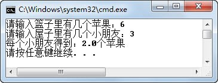

##  2.7  Java表达式

###  2.7.1  Java表达式概述  

&emsp;&emsp;表达式是符合一定语法规则的运算符和操作数的组合。下面列举了一些表达式，需要注意的是，单个操作数也是表达式。


```
x

y * 5

(a-b) * c - 4

(x>y)&&(m<=n)
```
&emsp;&emsp;表达式的值：对表达式中的操作数进行运算得到的结果。

&emsp;&emsp;表达式的类型：表达式的值的数据类型即为表达式的类型。

### 2.7.2  表达式的运算顺序  

&emsp;&emsp;Java表达式按照运算符的优先级从高到低的顺序进行运算，优先级相同的运算符按照事先约定的结合方向进行运算。运算符的优先级和结合性如表2.9所示。需要注意的是，程序员在编写代码时，是不会去记运算符的优先级的，当不确定运算符的优先级时，程序员通常的做法就是对先运算的部分加上小括号，保证此运算优先执行。
<p align="center">表2.9  Java运算符优先级及结合性</p>  


| 优先级 | 运算符                                                       | 结合性   |
| ------ | ------------------------------------------------------------ | -------- |
| 1      | ()  []  .                                                    | 从左向右 |
| 2      | !  +（正） -（负）  ~  ++  --                                | 从右向左 |
| 3      | *  /  %                                                      | 从左向右 |
| 4      | +（加） -（减）                                              | 从左向右 |
| 5      | <<    >>  >>>                                                | 从左向右 |
| 6      | <  <=  >    >=  instanceof                                   | 从左向右 |
| 7      | ==  !=                                                       | 从左向右 |
| 8      | &（按位与）                                                  | 从左向右 |
| 9      | ^                                                            | 从左向右 |
| 10     | &#124;                                                           | 从左向右 |
| 11     | &&                                                           | 从左向右 |
| 12     |&#124;&#124;                                                        | 从左向右 |
| 13     | ?:                                                           | 从右向左 |
| 14     | =  +=  -=  \*=  /=  %  =  &=    &#124;=  ^=  ~=  <<=  >>=    >>>= | 从右向左 |

 


&emsp;&emsp;下面的例子看起来很简单，但作为程序员，总是在不经意间犯下这样的错误。当程序运行结果和预期结果有差异时，往往不容易找出错误所在。

``` 

import java.util.Scanner;

class ShareApple {

    public static void main(String[] args) {

        int appleNum = 0;                 //苹果数

        int stuNum = -1;                    //小朋友数

        double stuApple = -1;           //每个小朋友得到多少苹果


        Scanner input = new Scanner(System.in);

        System.out.print("请输入篮子里有几个苹果：");

        appleNum = input.nextInt();

        System.out.print("请输入屋子里有几个小朋友：");

        stuNum = input.nextInt();

        stuApple = appleNum / stuNum;

        System.out.println("每个小朋友得到：" + stuApple + "个苹果");

    }

}
```


&emsp;&emsp;输入两组不同的值（苹果数和小朋友数），如图2.15和图2.16所示，其中第二组得到的并不是预期的结果。原因在于stuApple = appleNum / stuNum这条语句，首先运算的是appleNum / stuNum，之后再进行赋值运算。appleNum / stuNum这个表达式中的两个操作数都是int型的，其运算结果也是int型，所以出现了3除以6，得到int型0的情况，再将int型的0赋给double类型的stuApple，结果显示出0.0。


<p align="center"></p> 
<p align="center">图2.15  Java表达式执行示例一  </p>  

<p align="center"></p> 
<p align="center">图2.16  Java表达式执行示例二 </p>  
