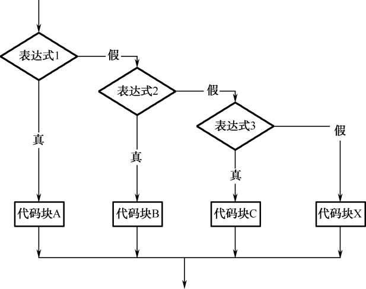

## 3.1  if语句

 

&emsp;&emsp;本章简介中提到的问题，其实利用现有的知识，在不使用if语句的情况下也能解决，代码如下。


```
import java.util.Scanner;

class TestIf1{

    public static void main(String[] args) {

        int JavaScore = -1;                //Java考试成绩

        Scanner input = new Scanner(System.in);

        System.out.print("请输入王云同学Java考试成绩：");

        JavaScore = input.nextInt();  //从控制台获取Java考试成绩

        //使用(表达式1)?(表达式2):(表达式3)这个三目运算符进行判断输出

        System.out.println(JavaScore>=60?("恭喜你，考试合格！"):("很难过地通知你，考试不及格，需要补考！"));

    }

}
```


&emsp;&emsp;这样的写法可以解决这个问题，但不够灵活。通过if语句，可以更加灵活地编写条件判断程序。

### 3.1.1  if语句的语法  

&emsp;&emsp;if语句有以下3种语法形式。

&emsp;&emsp;第一种形式为基本形式，其语法形式如下。


```
If(表达式){

	代码块

 }
```
&emsp;&emsp;其语义是：如果表达式的值为true，则执行其后的代码块，否则不执行该代码块。其执行过程如图3.1所示。

&emsp;&emsp;需要强调的是，在if语句中，表达式的类型必须是布尔类型，例如可以写成a == 3，但不要误写成a = 3（赋值语句）。

&emsp;&emsp;if语句的第二种语法形式如下。


```
If(表达式){

	代码块A

 }else{

	代码块B

}
```


&emsp;&emsp;其语义是：如果表达式的值为true，则执行其后的代码块A，否则执行代码块B。其执行过程如图3.2所示。  

<p align="center"></p>
<p align="center"> 图3.1  if语句语法形式一   </p>  
<p align="center"></p>
<p align="center">  图3.2  if语句语法形式二  </p>  
&emsp;&emsp;将前面使用三目运算符完成的程序换成使用if语句，代码如下所示。


```
import java.util.Scanner;

class TestIf2{

    public static void main(String[] args) {

        int JavaScore = -1;                //Java考试成绩

        Scanner input = new Scanner(System.in);

        System.out.print("请输入王云同学Java考试成绩：");

        JavaScore = input.nextInt();  //从控制台获取Java考试成绩

        //使用if...else...实现

        if(JavaScore >= 60){

        	System.out.println("恭喜你，考试合格！");

        }else{

        	System.out.println("很难过地通知你，考试不及格，需要补考！");

        }

    }

}
```


&emsp;&emsp;假设上面的程序需求发生了变化，更改为：如果王云同学的Java考试成绩和Web考试成绩都大于等于60分，则输出“恭喜你，获得Java初级工程师认证！”，否则输出“你有考试不及格，需要补考！”，具体的代码如下所示。


```
import java.util.Scanner;

class TestIf3{

	public static void main(String[] args) {

        int JavaScore = -1;                          //Java考试成绩

        int WebScore = -1;                         //Web考试成绩

        Scanner input = new Scanner(System.in);

        System.out.print("请输入王云同学Java考试成绩：");

        JavaScore = input.nextInt();            //从控制台获取Java考试成绩

        System.out.print("请输入王云同学Web考试成绩：");

        WebScore = input.nextInt();           //从控制台获取Web考试成绩

        //使用if...else...实现

        if(JavaScore >= 60 && WebScore >= 60)

        {

        	System.out.println("恭喜你，获得Java初级工程师认证！");

        }else{

        	System.out.println("你有考试不及格，需要补考！");

        }

    }

}
```


&emsp;&emsp;if语句的第三种语法形式如下。


```
if(表达式1){

	代码块A

}else if(表达式2){

	代码块B

}else if(表达式3){

	代码块C

…

}else{

	代码块X

}
```


&emsp;&emsp;其语义是：依次判断表达式的值，当出现某个表达式的值为true时，则执行其对应的代码块，然后跳到整个if语句之后继续执行程序。如果所有的表达式均为flase，则执行代码块X，然后继续执行后续程序，其执行过程如图3.3所示。

&emsp;&emsp;还是前面的例子，需求更改为：王云同学的Java考试成绩为x，则按以下要求输出结果。

- x **≥** 85，则输出“恭喜你，成绩优秀！”。

- 70 **≤** x < 85，则输出“恭喜你，成绩良好！”。

- 60 **≤** x < 70，则输出“恭喜你，成绩合格！”。

- x < 60，则输出“很抱歉，成绩不合格！”。

<p align="center"></p>
<p align="center"> 图3.3  if语句语法形式三 </p>  
&emsp;&emsp;具体代码如下所示。


```
import java.util.Scanner;

class TestIf4

{

	public static void main(String[] args) {

        int JavaScore = -1;                //Java考试成绩

        Scanner input = new Scanner(System.in);

        System.out.print("请输入王云同学Java考试成绩：");

        JavaScore = input.nextInt();  //从控制台获取Java考试成绩

        //使用if...else if...实现

        if(JavaScore >= 85)

        {

        	System.out.println("恭喜你，成绩优秀！");

        }else if(JavaScore >=70){

        	System.out.println("恭喜你，成绩良好！");

        }else if(JavaScore >=60){

        	System.out.println("恭喜你，成绩合格！");

        }else{

        	System.out.println("很抱歉，成绩不合格！");

        }

	}
}
```


&emsp;&emsp;注意，程序中判断表达式的前后顺序务必要有一定的规则，要么从大到小，要么从小到大，否则会出现错误。还是刚才的案例，如果把JavaScore >=70表达式及其之后的语句和JavaScore >=60表达式及其之后的语句换个位置，编译运行，当用户输入75的时候，就会输出“恭喜你，成绩合格！”，软件出现缺陷。


### 3.1.2  嵌套if语句  


&emsp;&emsp;有这样的需求：某小学需要从该校五、六年级学生中挑选一部分学生参加市数学竞赛，现对该校所有五、六年级学生进行了一次摸底考试，根据考试成绩，大于等于80分的可以参加数学竞赛，之后再根据年级分别进入五年级组和六年级组。

&emsp;&emsp;首先要判断学生考试成绩是否大于等于80分，在大于等于80分的基础上再判断是进入五年级组还是进入六年级组。所以使用嵌套的if语句，语法形式如下，具体的流程图如图3.4所示。


```
If(表达式1){

	If(表达式2){

    	代码块A

    }else{

    	代码块B

    }
    
}else{

    代码块C

} 

```

<p align="center"></p>
<p align="center"> 图3.4  嵌套的if语句 </p>  
&emsp;&emsp;具体程序代码如下所示。

```

import java.util.Scanner;

class TestIf5

{

    public static void main(String[] args) 

    {

        int score = -1;                                 //数学摸底考试成绩

        int grade = 5;                                  //学生年级数

        Scanner input = new Scanner(System.in);

        System.out.print("请输入数学摸底考试成绩：");

        score = input.nextInt();                             //从控制台获取数学摸底考试成绩

        //使用嵌套的if语句实现

        if(score >= 80)

        {

            System.out.print("请输入所属年级（只能输入“5”或“6”）：");

            grade = input.nextInt();                   //从控制台获取所属年级

            if (grade == 5)

            {

            	System.out.println("你将参加市五年级组数学竞赛！");

            }else{

            	System.out.println("你将参加市六年级组数学竞赛！");

            }

        }else{

            System.out.println("抱歉，不能参加市数学竞赛！");

        }

    }

}

```


