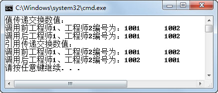
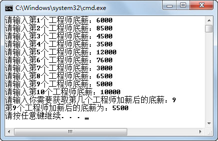
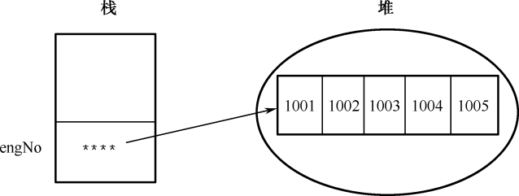
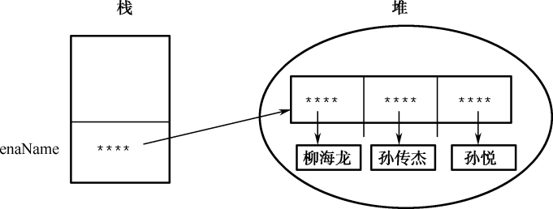

## 4.3  数组

&emsp;&emsp;在本章简介中提到现在《蓝桥系统》中存的是一个Java工程师，如果《蓝桥系统》需要存100个Java工程师，难道需要定义100个编号变量、100个姓名变量和100个底薪变量吗？显然，编程语言不会这么傻。Java提供了一种称为数组的数据类型，数组不是基本数据类型，而是引用数据类型。

&emsp;&emsp;数组是把相同类型的若干变量按一定顺序组织起来，这些按序排列的同类型数据元素的集合称为数组。数组有两个核心要素：相同类型的变量和按一定的顺序排列。数组中的元素在内存中是连续存储的。数组中的数据元素可以是基本类型，也可以是引用类型。

### 4.3.1  一维数组  

&emsp;&emsp;使用数组时，需要声明、创建、赋值和使用这几个步骤。

#### 1．数组的声明

&emsp;&emsp;声明数组的语法形式如下，推荐使用前一种。

```
数据类型[]  数组名;或  数据类型 数组名[];
```

&emsp;&emsp;声明数组就是告诉计算机，该数组中元素是什么类型的，例如：


```
int engNo[];

double[] engSalary;

String[] engName;//String字符串是引用类型，engName数组里存放的是引用类型元素
```

&emsp;&emsp;必须注意的是，Java语言中声明数组的时候不可以指定数组长度，例如int engNo[100]是非法的。

#### 2．创建数组

&emsp;&emsp;所谓创建数组，就是要为数组分配内存空间，不分配内存是不能存放数组元素的，创建数组就是在内存中划分出几个连续的空间用于依次存储数组中的数据元素，其语法形式如下。


```
数组名 = new 数据类型[数组长度];
```


&emsp;&emsp;可以把数组声明和数组创建合并，其语法形式为：


```
数据类型[]  数组名 = new 数据类型[数组长度];
```


&emsp;&emsp;其中数组长度就是数组中存放的元素个数，必须是整数。例如：


```
int[] engNo = new int[5];

String[] engName = new String[5];
```


#### 3．数组元素赋值和使用

&emsp;&emsp;创建完数组之后，就可以给数组赋值并使用数组了。在使用数组时，主要通过下标来访问数组元素。给数组赋值的语法形式如下。


```
数组名[数组下标] = 数值;
```


&emsp;&emsp;尤其需要注意的是，数组下标从0开始编号，数组名[0]代表数组中第1个元素，数组名[1]代表数组中第2个元素……数组下标的最大值为数组长度减1，如果下标值超过最大值会出现数组下标越界问题。例如：


```
engNo[0] = 1001;

engNo[1] = 1002;

engName[4] = "孙传杰";
```


&emsp;&emsp;第3章有这样一个例子：假设“蓝桥系统”中可以存放10个Java工程师信息，现在需要分别输入这10个Java工程师的底薪，计算出底薪大于等于6000的高薪人员比例以及这些高薪人员的底薪平均值，程序运行结果如图3.12所示。

&emsp;&emsp;之前的做法是：使用for循环，在用户输入的时候，立刻进行判断，统计出高薪人员的人数和高薪人员底薪总和，然后计算得出结果。但如果需要保留这10个Java工程师底薪的信息，并需要根据用户选择输出这个工程师的底薪（如图4.5所示），这样的做法就完成不了任务了。接下来采用数组来完成这个案例，具体代码如下。

<p align="center"></p>
<p align="center"> 图4.5  用数组存放Java工程师底薪 </p>  

```
import java.util.Scanner;

class TestArray1 

{

    public static void main(String[] args) 

    {

        int highNum = 0;       //底薪大于等于6000的Java工程师人数

        int sumBasSalary = 0;       //高薪人员底薪总和

        int[] basSalary = new int[10];    //创建一个长度为10的整型数组


        Scanner input = new Scanner(System.in);

        for(int i = 1;i <= 10 ; i++ )

        {

            System.out.print("请输入第" + i +"个工程师底薪：");  //依次让用户输入的第i个工程师的底薪，注意下标是i-1

            basSalary[i-1] = input.nextInt();

            if(basSalary[i-1] >= 6000)

            {

                highNum = highNum + 1;                        //高薪人员计数

                sumBasSalary = sumBasSalary + basSalary[i-1];     //高薪人员底薪求和

            }

        }

        System.out.println("10个Java工程师中，高薪人员比例为：" + highNum/10.0*100 + "%");

        System.out.println("高薪人员平均底薪为：" + sumBasSalary/highNum);


        System.out.print("请输入你需要获取第几个工程师的底薪：");

        int index = input.nextInt();

        System.out.println("第" + index + "个工程师的底薪为：" + basSalary[index-1]);

    }

}
```
### 4.3.2  引用数据类型  

&emsp;&emsp;前面学习Java基本数据类型的时候提到，Java数据类型分为两大类，分别是基本数据类型和引用数据类型，接下来会从存储空间的角度讲解引用数据类型。

&emsp;&emsp;假设声明Java工程师的底薪变量basSalary并对其赋值，其语句为：

```
int basSalary = 6000;
```

&emsp;&emsp;其内存操作为：首先系统给变量basSalary分配了4个字节的内存空间，然后把6000这个int型的数值赋给变量basSalary。

&emsp;&emsp;如果用数组（引用数据类型）存放5个Java工程师的底薪，其中第1个工程师的底薪为6000，其语句为：


```
int[] basSalary; 

basSalary = new int[5];

basSalary[0] = 6000;
```


&emsp;&emsp;其内存操作为：

&emsp;&emsp;首先声明了一个basSalary变量，这个变量是在栈中存放的一个地址，用于指向实际int型数组存放的位置。

&emsp;&emsp;在堆内存中创建5个连续的、存放int型元素的空间，并把存储空间的首地址赋给变量basSalary，使变量basSalary指向数组存放的位置。

&emsp;&emsp;在堆内存创建5个连续的、存放int型元素的空间时，会默认进行初始化，如图4.6所示。如果数组元素的类型为基本数据类型，其默认初始化的值为0、0.0、'\u0000'或false；如果是引用数据类型，默认初始化的值为null。

<p align="center"></p>
<p align="center"> 图4.6  引用数据类型初始化 </p>  

&emsp;&emsp;把6000这个int型的数值放入通过basSalary指向的数组存储空间的第1个位置，如图4.7所示。

<p align="center"></p>
<p align="center"> 图4.7  引用数据类型赋值 </p>  

&emsp;&emsp;内存存储形式的不同是基本数据类型和引用数据类型本质的区别，引用数据类型的名称实际代表的是存放引用数据类型的地址，不是引用数据类型本身。Java语言中，数组是引用数据类型，类以及后面要学到的接口也是引用数据类型，前面用到的存放字符串的String类型就是引用数据类型。

###  4.3.3  值传递与引用传递  

&emsp;&emsp;值传递和引用传递是调用方法时必须注意的问题。接下来看这样一段代码。


```
class TestArray2 

{

    public static void main(String[] args) 

    {

        int engNo1 = 1001;

        int engNo2 = 1002;

        System.out.println("值传递交换数值：");

        System.out.println("调用前工程师1、工程师2编号为：" + engNo1 + "\t" + engNo2);//调用前

        exchange1(engNo1, engNo2); //值传递，传递的实质是数值的副本，所以没有交换原值

        System.out.println("调用后工程师1、工程师2编号为：" + engNo1 + "\t" + engNo2);//调用后


        int[] engNo = new int[2];

        engNo[0] = 1001;

        engNo[1] = 1002;

        System.out.println("引用传递交换数值：");

        System.out.println("调用前工程师1、工程师2编号为：" + engNo[0] + "\t" + engNo[1]);//调用前

        exchange2(engNo);//引用传递，传递的实质是指向数组的地址，所以交换了数组里的值

        System.out.println("调用后工程师1、工程师2编号为：" + engNo[0] + "\t" + engNo[1]);//调用后

	 }

        //值传递，交换int型a和b的值

	public static void exchange1(int a,int b)

  	{

        int temp = a;

        a = b;

        b = temp;

   }

	//引用传递，交换数组x第1个元素和第2个元素的值

  	public static void exchange2(int[] x)

  	{

        int temp = x[0];

        x[0] = x[1];

        x[1] = temp;

    }

}
```


&emsp;&emsp;采用值传递时，其传递的实质是数值的副本，所以在调用使用值传递交换数据的方法时，只是在方法内将值的副本的数据内容进行了交换，其原数据本身并没有发生变化。

&emsp;&emsp;而采用引用传递时，其传递的实质为引用的地址，本例中传递的是数组的地址，在调用使用引用传递交换数据的方法时，是对这个地址指向的数据进行了交换，即对原数组的值进行了交换。

&emsp;&emsp;程序运行结果如图4.8所示。

<p align="center"></p>
<p align="center"> 图4.8  值传递和引用传递 </p>  

&emsp;&emsp;在图4.5所示的案例中，系统中可以存放10个Java工程师信息，容许用户输入这10个Java工程师的底薪，当时的需求如下。

&emsp;&emsp;（1）计算出底薪大于等于6000的高薪人员比例以及这些高薪人员的底薪平均值。

&emsp;&emsp;（2）输出用户选择的某个工程师的底薪。

&emsp;&emsp;现在调整需求，在用户输入这10个Java工程师的底薪后，对他们的底薪进行加薪，加薪标准如下。

&emsp;&emsp;（1）底薪大于等于6000元的高薪人员，加薪5%。

&emsp;&emsp;（2）非高薪人员，加薪10%。

&emsp;&emsp;最后输出用户选择的某个工程师加薪后的底薪，程序代码如下所示。


```
import java.util.Scanner;

class TestArray3 

{

    static int[] basSalary = new int[10];                  //创建一个长度为10的整型数组，存放工程师底薪

    static Scanner input = new Scanner(System.in);

    public static void main(String[] args) 

    {

        //调用inputEngSalary方法输入工程师底薪并执行加薪操作

        inputEngSalary(basSalary);            //采用引用传递

        System.out.print("请输入你需要获取第几个工程师加薪后的底薪：");

        int index = input.nextInt();

        System.out.println("第" + index + "个工程师加薪后的底薪为：" + basSalary[index-1]);

    }

    public static void inputEngSalary(int[] salary)

    {

        for(int i = 1;i <= 10 ; i++ )

        {

            System.out.print("请输入第" + i +"工程师底薪：");

            salary[i-1] = input.nextInt();

            if(salary[i-1] >= 6000)

            {

           		salary[i-1] = salary[i-1] + (int)(salary[i-1] * 0.05);   //高薪人员加薪5%

            }else{

            	salary[i-1] = salary[i-1] + (int)(salary[i-1] * 0.1);     //非高薪人员计数10%

            }

        }

    }

}

```

&emsp;&emsp;程序运行结果如图4.9所示。

<p align="center"></p>
<p align="center"> 图4.9  使用引用传递给工程师加薪 </p>  

### 4.3.4  一维数组初始化  

&emsp;&emsp;在前面的案例中，一般采用for循环的方式给数组赋值，接下来介绍一维数组初始化的方法。

&emsp;&emsp;在声明、创建的时候同时初始化，例如：


```
int[] engNo = new int[]{1001,1002,1003,1004,1005};

String[] engName = new String[]{"柳海龙","孙传杰","孙悦"};
```


&emsp;&emsp;甚至可以直接写成：


```
int[] engNo = {1001,1002,1003,1004,1005};

String[] engName = {"柳海龙","孙传杰","孙悦"};
```


&emsp;&emsp;int型、String型数组初始化时，内存中的结构如图4.10和图4.11所示。

<p align="center"></p>
<p align="center"> 图4.10  int型数组初始化</p>  

<p align="center"></p>
<p align="center"> 图4.11  String型数组初始化 </p>  

&emsp;&emsp;语句String[] engName = {"柳海龙","孙传杰","孙悦"};对数组声明、创建并初始化的过程可以细分为如下几步。

&emsp;&emsp;（1）String[] engName ——在栈内存中分配1个空间，用于存放字符串数组的地址。

&emsp;&emsp;（2）engName = new String[3]; ——在堆内存中分配3个连续空间，并把地址赋给engName，使栈内存中的地址指向这3个连续的内存空间，这3个空间里存放的默认初始值为null。

&emsp;&emsp;（3）engName[0] = "柳海龙";——在堆内存中创建字符串“柳海龙”，并把该引用类型的地址存放到engName数组的第1个元素空间里，使这个地址指向“柳海龙”这个引用类型。

&emsp;&emsp;（4）engName[1] = "孙传杰";——在堆内存中创建字符串“孙传杰”，并把该引用类型的地址存放到engName数组的第2个元素空间里，使这个地址指向“孙传杰”这个引用类型。

&emsp;&emsp;（5）engName[2] = "孙悦";——在堆内存中创建字符串“孙悦”，并把该引用类型的地址存放到engName数组的第3个元素空间里，使这个地址指向“孙悦”这个引用类型。

 

 
