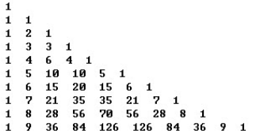

## 4.6  上机任务

#### 目标：使用二维数组打印出杨辉三角，程序运行结果如图4.13所示。

<p align="center"></p>
<p align="center"> 图4.13  使用二维数组打印杨辉三角 </p>  

时间：20分钟。


形式：小组讨论，每个学生独立编写代码，小组组长检查。


工具：EditPlus。


参考答案：


```
class Test2Array2 

{

    public static void main(String[] args) 

    { 

        int i,j; 

        int[][] a = new int[10][10];

        a[0][0] = 1;                                                    //给第一行数组元素赋值 

        for(i = 1;i < 10;i++)                                        //给二维数组元素赋值 

        {

            a[i][0] = 1;                                            //给第一列元素赋值  

            a[i][i] = 1;                                             //给对角线元素赋值  

            for(j = 1;j < i;j++)

            {

           		a[i][j] = a[i-1][j] + a[i-1][j-1];       //按杨辉三角规则赋值

            }

        } 

        for(i = 0;i < 10;i++)                                         //打印杨辉三角 

        {

        for(j = 0;j <= i;j++)   {                               //控制每行打印的个数

            System.out.print(" " + a[i][j] + " "); 

            System.out.println(); 

        }

    }

}

```

