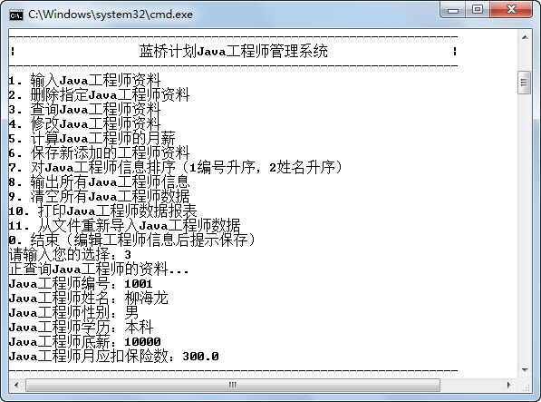

## 4.7  上机任务

#### 目标：

 

&emsp;&emsp;（1）完成《蓝桥系统》第二个模块“删除Java工程师资料”功能，实际是把Java工程师相关信息置为初始值，也需要将月工作完成分数、月实际工作天数和月薪置为初始值。

&emsp;&emsp;（2）完成《蓝桥系统》第三个模块“查询Java工程师资料”功能，实际是把Java工程师信息资料逐行输出，性别和学历不能输出数字，要输出真实文字，不显示月工作完成分数、月实际工作天数和月薪，程序运行结果如图4.14所示。

<p align="center"></p>
<p align="center"> 图4.14  查询Java工程师资料 </p>  

&emsp;&emsp;（3）完成《蓝桥系统》第四个模块“修改Java工程师资料”功能，和输入Java工程师资料功能类似，区别在于需要先输出原信息后再让用户输入新修改的信息，性别和学历不能输出数字，要输出真实文字，不修改月工作完成分数、月实际工作天数和月薪。

&emsp;&emsp;程序运行结果如图4.15所示。

<p align="center"></p>
<p align="center">图4.15  修改Java工程师资料</p>  

时间：100分钟。

形式：小组讨论，每个学生独立编写代码，小组组长检查。

工具：EditPlus。

参考答案：


```
//2. 删除Java工程师资料，实际是把Java工程师相关信息置为初始值

public static void deleteEngInf(){   

    if(status == false)                                     //表示Java工程师资料未输入或已删除

    {

        System.out.println("Java工程师资料未输入或已删除！");

        }else{

        engNo = -1;

        engName = "";

        engSex = -1;

        engEdu = -1;

        basSalary = 3000;

        comResult = 100;

        workDay = 22;

        insurance = 3000 * 0.105;

        engSalary = 0.0;

        status = false;                         //表示Java工程师资料未输入或已删除

    }

}

//3. 查询Java工程师资料，实际是把Java工程师信息资料逐行输出

public static void searchEngInf(){

    if(status == false)                                     //表示Java工程师资料未输入或已删除

    {

        System.out.println("Java工程师资料未输入或已删除！");

    }else{

        System.out.println("Java工程师编号：" + engNo);

        System.out.println("Java工程师姓名：" + engName);

        System.out.println("Java工程师性别：" + (engSex == 1 ?"男":"女"));

    switch (engEdu)                    //1代表大专，2代表本科，3代表硕士，4代表博士，5代表其他

    {

        case 1: 

            System.out.println("Java工程师学历：大专");

            break;

        case 2: 

            System.out.println("Java工程师学历：本科");

            break;        

        case 3: 

            System.out.println("Java工程师学历：硕士");

            break;

        case 4: 

            System.out.println("Java工程师学历：博士");

            break;        

        case 5: 

            System.out.println("Java工程师学历：其他");

            break;

        default: 

            System.out.println("Java工程师学历输入不正确");

            break;

    }

    System.out.println("Java工程师底薪：" + basSalary);

    System.out.println("Java工程师月应扣保险数：" + insurance);

    }

}

 

//4. 修改Java工程师资料，和输入Java工程师资料功能类似，区别在于需要先输出原信息再让用户

//输入新修改的信息

public static void modifyEngInf() 

{       

    if(status == false)                                              //表示Java工程师资料未输入或已删除

    {

    	System.out.println("Java工程师资料未输入或已删除，不能修改！");

    }else{

    	status = false;                                  //将Java工程师资料是否输入完毕置为否，需要修改

        while( !status )                                //如果Java工程师信息修改不完整，则全部重新修改

        {

            System.out.print("原来Java工程师的编号是：" + engNo + "，请输入修改后的编号：");

            engNo = input.nextInt();                           

            if(engNo <= 0)                      //Java工程师编号不能为负值

            {

                status = false;               //Java工程师信息输入不正确

                System.out.print("Java工程师编号不能为负值！");

                continue;                      //跳出本次循环，执行下一次输入Java工程师资料循环

            }

            else

            {

            	status = true;                //表示到目前为止，Java工程师信息输入正确

            }

            System.out.print("原来Java工程师的姓名是：" + engName + "，

            请输入修改后的姓名：");

            engName = input.next();                           

            if(engName.length() == 0)    //没有输入姓名，姓名的长度为0

            {

            status = false;               //Java工程师信息输入不正确

            System.out.print("Java工程师姓名不能为空！");

            continue;                      //跳出本次循环，执行下一次输入Java工程师资料循环

            }

            else

            {

                status = true;                          //表示到目前为止，Java工程师信息输入正确

            }

            System.out.print("原来Java工程师的性别是：" + (engSex == 1 ?"男":"女") + "，

            请输入修改后的性别：（1代表男，2代表女）");                

            engSex = input.nextInt();                                    

            if(engSex != 1 && engSex != 2)    //Java工程师性别既不是1，也不是2

            {

                status = false;                        //Java工程师信息输入不正确

                System.out.print("Java工程师性别只能输入1或2！");

                continue;                                //跳出本次循环，执行下一次输入Java工程师资料循环

            }

            else

            {

            	status = true;                          //表示到目前为止，Java工程师信息输入正确

            }

            switch (engEdu)                    //1代表大专，2代表本科，3代表硕士，4代表博士，

            ​                                              //5代表其他

            {

                case 1: 

                    System.out.println("原来Java工程师学历：大专");

                    break;

                case 2: 

                    System.out.println("原来Java工程师学历：本科");

                    break;        

                case 3: 

                    System.out.println("原来Java工程师学历：硕士");

                    break;

                case 4: 

                    System.out.println("原来Java工程师学历：博士");

                    break;        

                case 5: 

                    System.out.println("原来Java工程师学历：其他");

                    break;

                default: 

                    System.out.println("原来Java工程师学历不正确！");

                    break;

            }       

            System.out.print("请输入修改后的学历：（1代表大专，2代表本科，3代表硕士，

            4代表博士，5代表其他）");

            engEdu = input.nextInt();                                   

            if(engEdu != 1 && engEdu != 2 && engEdu != 3 && engEdu != 4 && engEdu != 5)

            //工程师学历不是1、2、3、4、5

            {

                status = false;               //Java工程师信息输入不正确

                System.out.print("学历只能输入1、2、3、4、5——（1代表大专，2代表本科，

                3代表硕士，4代表博士，5代表其他）！");

                continue;                      //跳出本次循环，执行下一次输入Java工程师资料循环

            }

            else

            {

                status = true;                //表示到目前为止，Java工程师信息输入正确

            }

            System.out.print("原来Java工程师的底薪是：" + basSalary + "，

            请输入修改后的底薪：");

            basSalary = input.nextInt();                       

            if(basSalary <= 0)                 //Java工程师底薪不能为负值

            {

                status = false;               //Java工程师信息输入不正确

                System.out.print("Java工程师底薪不能为负值！");

                continue;                      //跳出本次循环，执行下一次输入Java工程师资料循环

            }

            else

            {

                status = true;                //表示到目前为止，工程师信息输入正确

            }

            System.out.print("原来Java工程师的月应扣保险金额是：" + insurance + "，

            请输入修改后的月应扣保险数：");

            insurance = input.nextDouble();                         

            if(insurance <= 0)                 //Java工程师月应扣保险数不能为负值

            {

                status = false;               //Java工程师信息输入不正确

                System.out.print("Java工程师月应扣保险数不能为负值！");

                continue;                      //跳出本次循环，执行下一次输入Java工程师资料循环

            }

            else

            {

                status = true;                //表示到目前为止，Java工程师信息输入正确

            }

        }

    }

}

```

