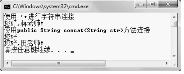

## 5.1  String类 

 

&emsp;&emsp;String类表示字符串，Java 程序中的所有字符串（例如“雷静”）都作为此类的对象。String类不是基本数据类型，它是一个类。因为对象的初始化默认值是null，所以String类对象的初始化默认值也是null。String是一种特殊的对象，具有其他对象没有的一些特性。  

&emsp;&emsp;String字符串是常量，字符串的值在创建之后不能更改。  

&emsp;&emsp;String类是最终类，不能被继承。  

### 5.1.1  String类的概念  

&emsp;&emsp;如何使用String类操作字符串呢？首先要定义并初始化字符串。String类包括以下常用的构造方法。  

- String(String s)：初始化一个新创建的String对象，使其表示一个与参数相同的字符序列。

- String(char[] value)：创建一个新的String对象，使其表示字符数组参数中当前包含的字符序列。

- String(char[] value, int offset, int count)：创建一个新的String对象，它包含取自字符数组参数的一个子数组的字符序列。offset参数是子数组第一个字符的索引（从0开始建立索引），count 参数指定子数组的长度。

&emsp;&emsp;例如：


```
String stuName1 = new String("王云");

char[] charArray = {'刘','静','涛'};

String stuName2 = new String(charArray);

String stuName3 = new String(charArray,1,2);//从'静'字开始，截取2个字符，结果是“静涛”

```

&emsp;&emsp;实际上，最常使用的创建String类字符串的方法如下。  


```
String stuName1 = "王云";
```


&emsp;&emsp;在实际编程过程中，常常有这样的需求，需要在一个字符串后面增加一些内容，例如需要在stuName1后面增加字符串“同学”。查询相关资料，知道String类提供了一个concat(String str)的方法，可以在String类字符串后面增加字符串。有如下代码：


```
class TestString2 

{

    public static void main(String[] args) 

    {

        String stuName1 = new String("王云");

        stuName1.concat("同学");

        System.out.println(stuName1);

    }

}
```


&emsp;&emsp;其输出结果是“王云”，而不是“王云同学”。为什么呢？

&emsp;&emsp;在本章开始就介绍过String字符串是常量，字符串的值在创建之后不能更改。concat(String str)方法的输出是，创建了一个新String字符串，用来存stuName1字符串加上“同学”的结果，而不是在原来stuName1字符串的后面增加内容，对于stuName1而言，它是常量，内容并没有变化。所以，如果想输出“王云同学”，可以将stuName1.concat("同学")表达式的结果赋给一个新的字符串，然后再输出该字符串即可。

&emsp;&emsp;再看下面的案例。

```
class TestString3 

{

    public static void main(String[] args) 

    {

        String stuName1 = new String("王云");

        System.out.println(stuName1);

        stuName1 = "刘静涛";

        System.out.println(stuName1);

    }

}
```


&emsp;&emsp;代码的输出结果如下。


```
王云

刘静涛
```

&emsp;&emsp;不是说String字符串是不可变的常量吗？怎么两次输出stuName1，却发生变化了呢？究其原因，主要是这里说的不可变是指在堆内存中创建出来的String字符串不可变。事实上，stuName1 = "刘静涛";语句已经新创建了一个String字符串，并让stuName1指向了这个新的String字符串，原来存放“王云”的这个String字符串没有发生变化，如图5.1所示。

<p align="center"></p>
<p align="center">图5.1  引用类型变量重赋值</p>  


### 5.1.2  String类的使用  

#### 1．连接字符串

&emsp;&emsp;前面介绍了采用public String concat(String str)方法连接字符串。事实上，采用最多的方法是使用“+”进行String字符串连接。之前的代码，在控制台输出程序运行结果的时候，都是使用“+”进行String字符串的连接。

&emsp;&emsp;执行下面的程序，其运行结果如图5.2所示。


```
public class TestStringConcat {

    public static void main(String[] args) {

        //使用"+"进行字符串连接

        System.out.println("使用'+'进行字符串连接");

        String s1 = "您好";

        s1 = s1 + ",蒋老师!";//创建一个新字符串用来连接两个字符串，并让s1指向这个新字符串

        System.out.println(s1);

        //使用public String concat(String str)方法连接

        System.out.println("使用public String concat(String str)方法连接");

        String s2 = "您好";

        //创建一个新字符串用来连接两个字符串，但没有变量指向这个新字符串

        s2.concat(",田老师!");

        //创建一个新字符串用来连接两个字符串，并让s3指向这个新字符串

        String s3 = s2.concat(",田老师!");

        System.out.println(s2);

        System.out.println(s3);

    }

}
```

<p align="center"></p>
<p align="center">图5.2  连接String字符串 </p>  


#### 2．比较字符串

&emsp;&emsp;比较字符串常用的两个方法是运算符“==”和String类的equals方法。

&emsp;&emsp;使用“==”比较两个字符串，是比较两个对象的地址是否一致，本质上就是判断两个变量是否指向同一个对象，如果是则返回true，否则返回false。而String类的equals方法则是比较两个String字符串的内容是否一致，返回值也是一个布尔类型。

&emsp;&emsp;先看下面的例子。


```
public class TestStringEquals {

    public static void main(String[] args) {

        String s1 = "Java基础";

        String s2 = "Java基础";

        System.out.println(s1 == s2);                           //返回true

        System.out.println(s1.equals(s2));           //返回true

        String s3 = new String("前端技术");

        String s4 = new String("前端技术");

        System.out.println(s3 == s4);                           //返回false

        System.out.println(s3.equals(s4));           //返回true

    }

}
```


&emsp;&emsp;程序的运行结果如图5.3所示。

 <p align="center"></p>
<p align="center"> 图5.3  比较String字符串 </p>  


