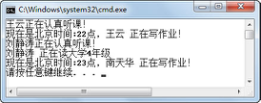

## 6.3  构造方法

 


&emsp;&emsp;在前面介绍封装的时候，一旦给学生对象的性别赋值之后就不能修改的这个需求其实并没有实现，因为通过Student wangYun = new Student();创建对象，然后通过wangYun.setStuSex(1);方法给学生对象wangYun的stuSex属性赋int型“1”这个值，之后仍然可以使用wangYun.setStuSex(2);方法将wangYun的stuSex属性值从“1”改为“2”，所以没有实现一旦赋值之后就不能修改的需求。

### 6.3.1  构造方法解决问题  

&emsp;&emsp;接下来通过构造方法的形式，实现上面的功能，将Student类的代码改造为如下形式。为了节省篇幅，省略了Student类中的其他方法。但务必注意的是，为了实现一旦给学生对象的性别赋值之后就不能修改的功能，所以去掉了setStuSex(int sex)的方法，保证其他对象不能修改学生对象的性别。


```
public class Student 

{

    private String stuName;                

    private int stuAge;                    

    private int stuSex;                     

    private int stuGrade;                   

    //**构造方法，用户初始化对象的成员变量**

    **public Student(String name,int age,int sex,int grade){**

    **this.stuName = name;**

    **this.stuAge = age;**

    **this.stuSex = sex;**        

    **this.stuGrade = grade;**

    **}**

    //省略了Student类中的其他方法

}
```


测试类TestStudent5的代码如下。


```
public class TestStudent5

{

    public static void main(String[] args) 

    {

        //使用带参的构造方法，创建wangYun学生类对象并初始化对象

        Student wangYun = new Student("王云",22,1,4);     

        wangYun.learn();

        String rstString = wangYun.doHomework(22);

        System.out.println(rstString);

    }

}
```

编译运行程序，其结果如图6.7所示。

<p align="center"></p>
<p align="center">图6.7  使用构造方法创建并初始化对象</p>  

### 6.3.2  构造方法的使用  

&emsp;&emsp;构造方法（也称为构造函数）是一种特殊的方法，它具有以下特点。

- 构造方法的方法名必须与类名相同。

- 构造方法没有返回类型，也不能定义为void，在方法名前不声明返回类型。

&emsp;&emsp;其实构造方法是有返回值的，返回的是刚刚被初始化完成的当前对象的引用。既然构造方法返回被初始化对象的引用，为什么不写返回值类型呢？例如Student类构造方法为什么不写成 public Student Student（参数列表）｛…｝呢？

&emsp;&emsp;因为Java设计人员把这种方法名（类名）和返回类型的类名相同的方法看成一个普通方法，只是名称“碰巧”相同罢了，编译器识别时也会认为它是一个方法。为了和普通方法进行区别，Java设计人员规定构造方法不写返回值，编译器通过这一规定识别构造方法，而不是说构造方法真的没有返回值。

&emsp;&emsp;构造方法的主要作用是完成对象的初始化工作，它能够把定义对象时的参数传给对象。一个类可以定义多个构造方法，根据参数的个数、类型或排列顺序来区分不同的构造方法。


```
public class Student 

{

    private String stuName;       

    private int stuAge;            

    private int stuSex;           

    private int stuGrade;         

    //构造方法，用户初始化对象的属性

    public Student(String name,int age,int sex,int grade){

        this.stuName = name;

        this.stuAge = age;

        this.stuSex = sex;         

        this.stuGrade = grade;

    }

    //构造方法，用户初始化对象的属性（不带年级参数，设置年级默认值为4）

    public Student(String name,int age,int sex){

        this.stuName = name;

        this.stuAge = age;

        this.stuSex = sex;

        this.stuGrade = 4;

    }       

    //构造方法，用户初始化对象的属性

    //不带年龄、年级参数，设置年龄默认值为22，年级默认值为4

    public Student(String name,int sex){

        this.stuName = name;

        this.stuAge = 22;

        this.stuSex = sex;

        this.stuGrade = 4;

    }

    //省略了Student类中的其他方法

}
```


&emsp;&emsp;新建测试类TestStudent6，其代码如下，运行结果如图6.8所示。


```
public class TestStudent6

{

    public static void main(String[] args) 

    {

        //使用不同参数列表的构造方法创建wangYun、liuJT、nanTH三个学生类对象

        Student wangYun = new Student("王云",22,1,4);     

        Student liuJT = new Student("刘静涛",21,2);  

        Student nanTH = new Student("南天华",1);


        wangYun.learn();

        String rstString = wangYun.doHomework(22);

        System.out.println(rstString);


        liuJT.learn();                          //调用liuJT对象的learn()方法

        //调用liuJT对象的getStuName()和getStuGrade()方法获得属性值

        System.out.println(liuJT.getStuName() + " 正在读大学" + liuJT.getStuGrade() + "年级");


        System.out.println(nanTH.doHomework(23));          //调用nanTH对象的doHomework(23)方法

    }

}
```

<p align="center"></p>
<p align="center">图6.8  使用类的多个构造方法</p>  
&emsp;&emsp;如果在定义类时没有定义构造方法，则编译系统会自动插入一个无参数的默认构造方法，这个构造方法不执行任何代码。如果在定义类时定义了有参的构造方法，没有显式地定义无参的构造方法，那么在使用构造方法创建类对象时，则不能使用默认的无参构造方法。

&emsp;&emsp;例如，在TestStudent6程序的main方法内添加一行语句：Student leiJing = new Student();，编译器会报错，提示没有找到无参的构造方法。


