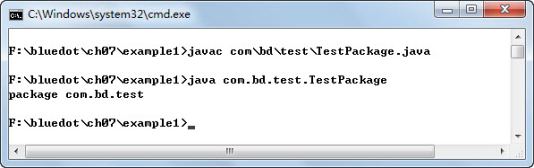
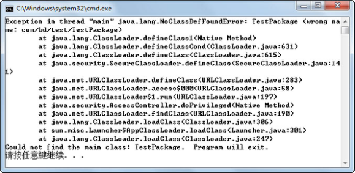
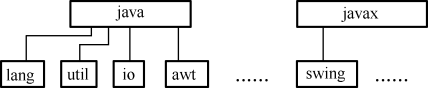

## 7.1  Java包

 

&emsp;&emsp;在计算机中存放了若干类型的文档，为了管理方便，操作系统采用了树形结构的文件夹形式存放这些文档，并对文档进行管理。

&emsp;&emsp;例如，在Windows操作系统中，可以将硬盘划分为C、D、E、F四个分区（简称C、D、E、F盘）。为了达到分类管理的目的，可以将程序安装在C盘，把工作用到的文档放在D盘，把生活中产生的文档放在E盘，最后用F盘作为备份盘，用于备份文件。

&emsp;&emsp;这样做的好处是不仅可以将文档分门别类地存储，易于查找，同时还可以在不同的盘符下存放同名的文件，解决了文件名冲突的问题。

&emsp;&emsp;为了更好地组织类，Java提供了包机制。包是类的容器，用于分隔类名空间。如果没有指定包名，所有的类都属于一个默认的无名包。

&emsp;&emsp;Java中的包一般都包含功能相关的类。例如，Java中通用的工具类，一般都放在java.util包中。

&emsp;&emsp;总地来说，包有以下3个方面的作用。

&emsp;&emsp;（1）提供了类似于操作系统树形文件夹的组织形式，能分门别类地存储、管理类，易于查找并使用类。

&emsp;&emsp;（2）解决了同名类的命名冲突问题。学生王云定义了一个类，类名叫TestStudent，学生刘静涛也定义了一个叫TestStudent的类。如果在同一个文件夹下，就会产生命名冲突的问题。使用了包的机制，就可以把王云定义的类放在wangyun包下，把刘静涛定义的类放在liujingtao包下，那么就可以通过wangyun. TestStudent和liujingtao. TestStudent访问不同的类，解决了命名冲突的问题。

&emsp;&emsp;（3）包允许在更广的范围内保护类、属性和方法。关于这方面的作用，在本章后面介绍访问权限的时候，大家就能体会到。

 

### 7.1.1  包的使用  


&emsp;&emsp;程序员可以使用package关键字指明源文件中的类属于哪个具体的包，包的语法形式如下。


```
package pkg1[．pkg2[．pkg3…]];
```


&emsp;&emsp;程序中如果有package语句，该语句一定是源文件中的第一条可执行语句，它的前面只能有注释或空行。另外，一个文件中最多只能有一条package语句。

&emsp;&emsp;包的名字有层次关系，各层之间以点分隔，包层次必须与Java开发环境文件系统的层次结构相同。通常包名全部用小写字母，这与类名以大写字母开头且各单词的首字母亦大写的命名约定有所不同。关于包的命名，现在使用得最多的规则是使用internet域名，并将其中的元素颠倒过来。例如abc公司的域名为www.abc.com , 该公司开发部门正开发了一个叫fly的项目，在这个项目中有一个工具类的包，则这个工具包的包名可以为：com.abc.fly.tools。

来看下面的例子。


```
package com.bd.test;              //声明包

public class TestPackage

{

    public static void main(String[] args) 

    {

        System.out.println("package com.bd.test");

    }

}
```


&emsp;&emsp;注意，要编译运行这个程序，首先需要在当前目录下依次建立com、bd和test子目录，如图7.1所示，在com\bd\test子目录下创建TestPackage.java文件。

&emsp;&emsp;要编译运行这个程序，推荐的做法是首先退到当前目录（如图7.1所示的example1目录），再执行javac com\bd\test\TestPackage.java命令编译这个java源文件。运行时，也是在当前目录下执行java com.bd.test.TestPackage，可以看到运行结果，如图7.2所示。

<p align="center"></p>
<p align="center">图7.1  包目录结构 </p>  
<p align="center"></p>
<p align="center">图7.2  编译运行包下的程序</p>  

​                          

### 7.1.2  调整EditPlus  

&emsp;&emsp;为了让大家熟悉Java基础语法和类库，从第1章开始，我们一直使用EditPlus连接JDK编辑、编译和运行Java程序。如今引入了包的概念，编译和运行的目录不再是Java源文件所在的目录。按照之前配置的用户工具进行运行（Ctrl+2），会出现找不到类的错误，如图7.3所示。

<p align="center"></p>
<p align="center">图7.3  EditPlus运行包下的程序结果</p>  


&emsp;&emsp;从图7.3所示的结果中可以看到，在Java源文件所在的目录下直接执行java TestPackage命令，找不到类的错误。如何调整EditPlus解决这个问题呢？其实只要调整运行路径和运行文件名，就可以解决这个问题。

&emsp;&emsp;打开EditPlus配置用户工具对话框，选择“JAVA”工具，将参数从“$(FileNameNoExt)”修改为“com.bd.test.$(FileNameNoExt)”（带上包名的Java文件名），将初始目录从“$(FileDir)”修改为“F:\bluedot\ch07\example1”（执行java命令的真实路径），如图7.4所示。

<p align="center"></p>
<p align="center">图7.4  调整EditPlus中的Java运行环境   </p>  


&emsp;&emsp;在EditPlus中再次运行程序（Ctrl+2），程序能正常运行。

### 7.1.3  JDK中的包  

&emsp;&emsp;JDK的类库被分成许多包，这些包是分层次组织的，就像在硬盘上嵌套有各级子目录一样。最高一级的包名是java和javax，其下一级的包名有lang、util、net、io等，如图7.5所示。

 <p align="center"></p>
<p align="center">图7.5  JDK包结构</p>  

&emsp;&emsp;下面简要介绍JDK类库中不同包的主要功能。

- java.lang：提供利用Java编程语言进行程序开发的基础类，例如String、Math、Integer、System和Thread等。

- java.util：Java工具类，包含对集合的操作、事件模型、日期和时间设置、国际化和各种实用工具类。

- java.io：通过数据流、序列化和文件系统提供系统输入和输出。

- java.net：为实现网络应用程序而提供的类。

- java.awt：包含用于创建用户界面和绘制图形图像的类。

 
